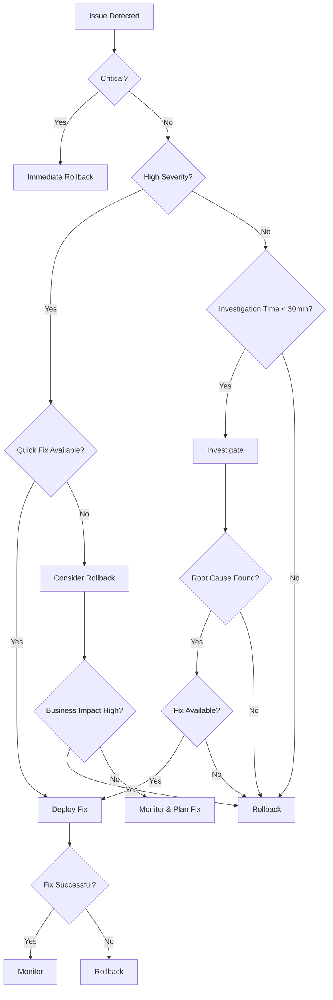

# Parsify.dev Emergency Rollback & Issue Resolution Procedures

**Project**: Developer Tools Platform Expansion  
**Version**: 1.0.0  
**Date**: 2025-01-11  
**Environment**: Production (https://parsify.dev)  

---

## 🎯 Overview

This document defines comprehensive emergency rollback and issue resolution procedures for the Parsify.dev developer tools platform. These procedures ensure rapid response to production issues, minimize user impact, and maintain service reliability.

---

## 🚨 Emergency Classification & Response

### Issue Severity Classification

#### Critical (Level 1) - Immediate Response Required
- **Complete service outage** - All users unable to access the platform
- **Critical functionality broken** - Core tools completely non-functional
- **Security vulnerability** - Active exploit or data breach
- **Data corruption** - User data loss or corruption
- **Performance degradation** - Response times > 10 seconds

**Response Time**: < 5 minutes  
**Escalation**: Immediate  
**Rollback Decision**: Automatic or immediate manual

#### High (Level 2) - Urgent Response Required
- **Partial service outage** - Significant functionality broken
- **Major performance issues** - Response times 5-10 seconds
- **User experience severely degraded** - >50% of users affected
- **Critical bugs** - Tool failures causing user frustration
- **Accessibility issues** - WCAG violations affecting users with disabilities

**Response Time**: < 15 minutes  
**Escalation**: Within 15 minutes  
**Rollback Decision**: Consider after investigation

#### Medium (Level 3) - Priority Response Required
- **Minor functionality issues** - Some tools having problems
- **Performance degradation** - Response times 3-5 seconds
- **User experience issues** - Affecting <50% of users
- **Non-critical bugs** - Inconvenient but not blocking
- **Mobile-specific issues** - Problems on mobile devices

**Response Time**: < 1 hour  
**Escalation**: Within 1 hour  
**Rollback Decision**: Consider with other solutions

#### Low (Level 4) - Normal Response Required
- **Minor visual issues** - UI/UX improvements needed
- **Edge case bugs** - Affecting very few users
- **Performance optimization** - Minor slowdowns
- **Documentation issues** - Missing or incorrect information
- **Feature requests** - Enhancements rather than bugs

**Response Time**: < 24 hours  
**Escalation**: Within 24 hours  
**Rollback Decision**: Not typically required

---

## 🔄 Rollback Decision Matrix

### Automatic Rollback Triggers
```yaml
automatic_triggers:
  health_check_failures:
    condition: ">= 5 consecutive health check failures"
    response_time: "Immediate"
    action: "Execute automatic rollback"
  
  error_rate_threshold:
    condition: "Error rate >= 10% for 5 minutes"
    response_time: "Immediate"
    action: "Execute automatic rollback"
  
  performance_threshold:
    condition: "Average response time >= 10 seconds"
    response_time: "Immediate"
    action: "Execute automatic rollback"
  
  resource_usage_threshold:
    condition: "Memory usage >= 95% OR CPU usage >= 90%"
    response_time: "Immediate"
    action: "Execute automatic rollback"
  
  critical_functionality_failure:
    condition: "Homepage or core tools completely broken"
    response_time: "Immediate"
    action: "Execute automatic rollback"
```

### Manual Rollback Decision Criteria
```yaml
manual_triggers:
  business_impact:
    high_revenue_loss: "Consider rollback immediately"
    customer_complaints_surge: "Consider rollback if >50/hour"
    brand_reputation_risk: "Consider rollback if media attention"
  
  technical_factors:
    rootcause_unknown: "Rollback if investigation will take >30 minutes"
    fix_unavailable: "Rollback if no quick fix available"
    risk_escalation: "Rollback if issue might worsen"
  
  user_impact:
    accessibility_violations: "Consider rollback for WCAG violations"
    data_loss_risk: "Immediate rollback if data corruption risk"
    security_concerns: "Immediate rollback for security issues"
```

### Rollback vs Fix Decision Framework


---

## 🛠️ Rollback Execution Procedures

### Phase 1: Immediate Response (First 5 minutes)

#### 1.1 Issue Detection & Assessment
```bash
#!/bin/bash
# Issue Detection Script - issue-detection.sh

DOMAIN="parsify.dev"
ALERT_THRESHOLD=3
MONITORING_INTERVAL=30

function detect_issue() {
    local failures=0
    
    # Health checks
    for i in {1..3}; do
        if ! curl -f -s --max-time 5 "https://$DOMAIN/api/health" > /dev/null 2>&1; then
            failures=$((failures + 1))
        fi
        sleep 2
    done
    
    if [ $failures -ge $ALERT_THRESHOLD ]; then
        echo "🚨 CRITICAL: Multiple health check failures detected"
        trigger_emergency_response "Health check failures"
        return 1
    fi
    
    # Performance check
    local response_time=$(curl -o /dev/null -s -w '%{time_total}' "https://$DOMAIN/" 2>/dev/null)
    if (( $(echo "$response_time > 10" | bc -l) )); then
        echo "⚠️  WARNING: Slow response time detected (${response_time}s)"
        trigger_high_priority_response "Slow response time"
    fi
    
    # Error rate check (via analytics endpoint)
    local error_rate=$(curl -s "https://$DOMAIN/api/analytics/error-rate" 2>/dev/null || echo "0")
    if (( $(echo "$error_rate > 0.1" | bc -l) )); then
        echo "🚨 CRITICAL: High error rate detected (${error_rate})"
        trigger_emergency_response "High error rate"
        return 1
    fi
    
    return 0
}

function trigger_emergency_response() {
    local reason="$1"
    local timestamp=$(date -u +%Y-%m-%dT%H:%M:%SZ)
    
    # Create incident record
    cat > "emergency-incident-${timestamp}.json" << EOF
{
    "timestamp": "$timestamp",
    "severity": "critical",
    "reason": "$reason",
    "domain": "$DOMAIN",
    "triggered_by": "automated_monitoring",
    "action": "emergency_rollback_initiated"
}
EOF
    
    # Send alerts
    send_emergency_alert "$reason" "critical"
    
    # Execute rollback
    execute_emergency_rollback "$reason"
}

function trigger_high_priority_response() {
    local reason="$1"
    local timestamp=$(date -u +%Y-%m-%dT%H:%M:%SZ)
    
    # Create incident record
    cat > "high-priority-incident-${timestamp}.json" << EOF
{
    "timestamp": "$timestamp",
    "severity": "high",
    "reason": "$reason",
    "domain": "$DOMAIN",
    "triggered_by": "automated_monitoring",
    "action": "investigation_required"
}
EOF
    
    # Send alerts
    send_emergency_alert "$reason" "high"
}

function send_emergency_alert() {
    local reason="$1"
    local severity="$2"
    
    # Slack alert
    curl -X POST "https://hooks.slack.com/services/YOUR/SLACK/WEBHOOK" \
        -H 'Content-type: application/json' \
        --data "{
            \"text\": \"🚨 PARSIFY.EMERGENCY [$severity] $reason\",
            \"channel\": \"#emergency\",
            \"username\": \"Emergency Bot\"
        }"
    
    # Email alert (would use email service in production)
    echo "Emergency alert sent: $reason ($severity)"
}

# Main monitoring loop
while true; do
    detect_issue
    sleep $MONITORING_INTERVAL
done
```

#### 1.2 Communication & Notification
```bash
#!/bin/bash
# Emergency Communication Script - emergency-communication.sh

INCIDENT_ID="$1"
SEVERITY="$2"
MESSAGE="$3"

function send_slack_alert() {
    local channel="$1"
    local message="$2"
    local severity="$3"
    
    local color="good"
    case "$severity" in
        "critical") color="danger" ;;
        "high") color="warning" ;;
        "medium") color="#ff9500" ;;
    esac
    
    curl -X POST "https://hooks.slack.com/services/YOUR/SLACK/WEBHOOK" \
        -H 'Content-type: application/json' \
        --data "{
            \"attachments\": [{
                \"color\": \"$color\",
                \"title\": \"Parsify.dev Emergency Alert\",
                \"text\": \"$message\",
                \"fields\": [{
                    \"title\": \"Incident ID\",
                    \"value\": \"$INCIDENT_ID\",
                    \"short\": true
                }, {
                    \"title\": \"Severity\",
                    \"value\": \"$severity\",
                    \"short\": true
                }, {
                    \"title\": \"Time\",
                    \"value\": \"$(date -u +%Y-%m-%dT%H:%M:%SZ)\",
                    \"short\": true
                }],
                \"footer\": \"Parsify.dev Emergency System\",
                \"ts\": $(date +%s)
            }]
        }"
}

function update_status_page() {
    local status="$1"
    local message="$2"
    
    # Update status page (would use status page service)
    echo "Status page updated: $status - $message"
    
    # Create local status record
    cat > "status-update-$(date +%s).json" << EOF
{
    "timestamp": "$(date -u +%Y-%m-%dT%H:%M:%SZ)",
    "status": "$status",
    "message": "$message",
    "incident_id": "$INCIDENT_ID"
}
EOF
}

function notify_stakeholders() {
    local message="$1"
    
    # Send to stakeholders list
    local stakeholders=("devops@parsify.dev" "product@parsify.dev" "support@parsify.dev")
    
    for stakeholder in "${stakeholders[@]}"; do
        echo "Notifying stakeholder: $stakeholder"
        # send_email "$stakeholder" "Parsify.dev Emergency Alert" "$message"
    done
}

function communicate_rollback_initiation() {
    local reason="$1"
    local message="🔄 Emergency rollback initiated due to: $reason"
    
    # Send to multiple channels
    send_slack_alert "#emergency" "$message" "critical"
    send_slack_alert "#general" "$message" "high"
    update_status_page "rollback_in_progress" "$message"
    notify_stakeholders "$message"
    
    echo "Emergency communication sent for rollback initiation"
}

function communicate_rollback_completion() {
    local success="$1"
    local reason="$2"
    local timestamp=$(date -u +%Y-%m-%dT%H:%M:%SZ)
    
    if [ "$success" = "true" ]; then
        local message="✅ Emergency rollback completed successfully. Reason: $reason"
        local status="operational"
    else
        local message="❌ Emergency rollback failed. Manual intervention required. Reason: $reason"
        local status="major_outage"
    fi
    
    send_slack_alert "#emergency" "$message" "$success"
    send_slack_alert "#general" "$message" "high"
    update_status_page "$status" "$message"
    notify_stakeholders "$message"
    
    echo "Rollback completion communication sent"
}

# Usage examples
# communicate_rollback_initiation "Health check failures"
# communicate_rollback_completion "true" "Health check failures resolved"
```

### Phase 2: Rollback Execution (Minutes 5-15)

#### 2.1 Automated Rollback Script
```bash
#!/bin/bash
# Emergency Rollback Script - emergency-rollback.sh
set -e

ROLLBACK_REASON="${1:-Emergency rollback}"
DOMAIN="parsify.dev"
BACKUP_DIR="/var/backups/parsify"
LOG_FILE="/var/log/parsify/emergency-rollback.log"
TIMESTAMP=$(date -u +%Y-%m-%dT%H:%M:%SZ)
ROLLBACK_ID="rollback-$(date +%s)"

# Logging function
log() {
    echo "[$(date '+%Y-%m-%d %H:%M:%S')] $1" | tee -a "$LOG_FILE"
}

# Function to check system health
check_health() {
    local health_url="https://$DOMAIN/api/health"
    local max_attempts=10
    local attempt=1
    
    while [ $attempt -le $max_attempts ]; do
        log "Health check attempt $attempt/$max_attempts"
        
        if curl -f -s --max-time 10 "$health_url" > /dev/null 2>&1; then
            log "✅ Health check passed"
            return 0
        fi
        
        log "❌ Health check failed, retrying in 30 seconds..."
        sleep 30
        attempt=$((attempt + 1))
    done
    
    log "❌ Health check failed after $max_attempts attempts"
    return 1
}

# Function to create backup before rollback
create_backup() {
    log "📦 Creating backup before rollback..."
    
    local backup_file="$BACKUP_DIR/pre-rollback-$ROLLBACK_ID.json"
    mkdir -p "$BACKUP_DIR"
    
    # Get current deployment info
    local deployment_info=$(vercel ls --scope $VERCEL_ORG_ID -n 1 --json 2>/dev/null || echo "{}")
    
    cat > "$backup_file" << EOF
{
    "timestamp": "$TIMESTAMP",
    "rollback_id": "$ROLLBACK_ID",
    "reason": "$ROLLBACK_REASON",
    "deployment_info": $deployment_info,
    "domain": "$DOMAIN",
    "pre_rollback_health": $(check_health && echo '"healthy"' || echo '"unhealthy"')
}
EOF
    
    log "📋 Backup created: $backup_file"
}

# Function to execute rollback
execute_rollback() {
    log "🔄 Executing rollback..."
    
    # Get previous stable deployment
    local previous_deployment=$(vercel ls --scope $VERCEL_ORG_ID -n 5 | grep -E "Ready|Built" | head -2 | tail -1 | awk '{print $1}')
    
    if [ -z "$previous_deployment" ]; then
        log "❌ No previous stable deployment found"
        return 1
    fi
    
    log "🎯 Target deployment: $previous_deployment"
    
    # Execute rollback
    if vercel rollback "$previous_deployment"; then
        log "✅ Rollback command executed successfully"
        return 0
    else
        log "❌ Rollback command failed"
        return 1
    fi
}

# Function to wait for rollback propagation
wait_for_propagation() {
    log "⏳ Waiting for rollback propagation..."
    local wait_time=300  # 5 minutes
    local check_interval=30
    local elapsed=0
    
    while [ $elapsed -lt $wait_time ]; do
        log "Checking rollback status (${elapsed}s elapsed)..."
        
        if check_health; then
            log "✅ Rollback propagation completed successfully"
            return 0
        fi
        
        sleep $check_interval
        elapsed=$((elapsed + check_interval))
    done
    
    log "⚠️  Rollback propagation timeout reached"
    return 1
}

# Function to validate rollback success
validate_rollback() {
    log "🔍 Validating rollback success..."
    
    # Health check
    if ! check_health; then
        log "❌ Health check failed after rollback"
        return 1
    fi
    
    # Critical functionality checks
    local critical_urls=(
        "https://$DOMAIN/"
        "https://$DOMAIN/tools"
        "https://$DOMAIN/api/health"
    )
    
    for url in "${critical_urls[@]}"; do
        if ! curl -f -s --max-time 10 "$url" > /dev/null 2>&1; then
            log "❌ Critical URL not accessible: $url"
            return 1
        fi
    done
    
    log "✅ All critical functionality verified"
    return 0
}

# Function to create rollback report
create_rollback_report() {
    local success="$1"
    local message="$2"
    
    local report_file="$BACKUP_DIR/rollback-report-$ROLLBACK_ID.json"
    
    cat > "$report_file" << EOF
{
    "rollback_id": "$ROLLBACK_ID",
    "timestamp": "$TIMESTAMP",
    "reason": "$ROLLBACK_REASON",
    "success": $success,
    "message": "$message",
    "execution_time": $(date +%s),
    "domain": "$DOMAIN",
    "post_rollback_health": $(check_health && echo '"healthy"' || echo '"unhealthy"'),
    "rollback_log": "$LOG_FILE"
}
EOF
    
    log "📊 Rollback report created: $report_file"
}

# Function to send notifications
send_notifications() {
    local success="$1"
    local message="$2"
    
    log "📢 Sending rollback notifications..."
    
    # Send to communication system
    if command -v ./emergency-communication.sh >/dev/null 2>&1; then
        ./emergency-communication.sh "$ROLLBACK_ID" "critical" "Emergency rollback: $message"
    fi
    
    # Log notification
    log "📧 Notifications sent for rollback: $success"
}

# Main rollback execution
main() {
    log "🚨 Emergency Rollback Initiated"
    log "Rollback ID: $ROLLBACK_ID"
    log "Reason: $ROLLBACK_REASON"
    log "Domain: $DOMAIN"
    log "Timestamp: $TIMESTAMP"
    
    # Create backup
    create_backup
    
    # Execute rollback
    if execute_rollback; then
        # Wait for propagation
        if wait_for_propagation; then
            # Validate rollback
            if validate_rollback; then
                local message="Rollback completed successfully. System is healthy."
                log "✅ $message"
                create_rollback_report "true" "$message"
                send_notifications "true" "$message"
                exit 0
            else
                local message="Rollback executed but validation failed."
                log "❌ $message"
                create_rollback_report "false" "$message"
                send_notifications "false" "$message"
                exit 1
            fi
        else
            local message="Rollback executed but propagation timeout reached."
            log "❌ $message"
            create_rollback_report "false" "$message"
            send_notifications "false" "$message"
            exit 1
        fi
    else
        local message="Rollback execution failed."
        log "❌ $message"
        create_rollback_report "false" "$message"
        send_notifications "false" "$message"
        exit 1
    fi
}

# Execute main function
main "$@"
```

#### 2.2 Manual Rollback Procedures
```markdown
## Manual Rollback Procedures

### Step 1: Issue Assessment (Minutes 0-2)
1. **Assess Impact**
   - Determine affected users and functionality
   - Estimate business impact
   - Check for security implications

2. **Gather Information**
   - Review error logs and metrics
   - Check recent deployments
   - Interview affected users if possible

3. **Make Rollback Decision**
   - Use decision matrix to evaluate
   - Consider alternative solutions
   - Document decision rationale

### Step 2: Preparation (Minutes 2-5)
1. **Communicate Decision**
   - Alert incident response team
   - Notify stakeholders
   - Prepare user communication

2. **Prepare Systems**
   - Verify rollback target deployment
   - Test rollback access
   - Prepare monitoring systems

3. **Backup Current State**
   - Create deployment backup
   - Document current issues
   - Note rollback target

### Step 3: Execute Rollback (Minutes 5-10)
1. **Execute Rollback Command**
   ```bash
   # Using Vercel CLI
   vercel rollback <deployment-id>
   
   # Or using deployment URL
   vercel rollback https://parsify-dev-<hash>.vercel.app
   ```

2. **Monitor Progress**
   - Watch rollback logs
   - Check system status
   - Verify completion

3. **Validate Basic Functionality**
   - Check homepage loads
   - Verify API endpoints
   - Test core tools

### Step 4: Validation & Stabilization (Minutes 10-15)
1. **Comprehensive Testing**
   - Run health check suite
   - Test critical user flows
   - Verify performance metrics

2. **Monitor System Health**
   - Watch error rates
   - Check performance metrics
   - Monitor user feedback

3. **Communicate Resolution**
   - Update status page
   - Notify stakeholders
   - Inform users

### Step 5: Post-Rollback Activities (Minutes 15+)
1. **Documentation**
   - Document rollback details
   - Create incident report
   - Update runbooks

2. **Root Cause Analysis**
   - Investigate original issue
   - Identify root causes
   - Plan preventative measures

3. **Recovery Planning**
   - Plan fix implementation
   - Schedule re-deployment
   - Update monitoring
```

---

## 🧪 Issue Resolution Procedures

### Phase 1: Investigation & Diagnosis

#### 1.1 Systematic Troubleshooting Checklist
```markdown
## Systematic Troubleshooting Checklist

### Infrastructure Issues
- [ ] **Server Status**: Check server health metrics
- [ ] **Database**: Verify database connectivity and performance
- [ ] **Network**: Test network connectivity and latency
- [ ] **CDN**: Verify CDN status and cache clearing
- [ ] **DNS**: Check DNS resolution and propagation
- [ ] **SSL**: Verify SSL certificate validity

### Application Issues
- [ ] **Build Process**: Check for build errors or warnings
- [ ] **Dependencies**: Verify all dependencies installed correctly
- [ ] **Configuration**: Review environment variables and settings
- [ ] **Memory Usage**: Check for memory leaks or excessive usage
- [ ] **CPU Usage**: Monitor CPU utilization and spikes
- [ ] **Disk Space**: Verify sufficient disk space available

### Code Issues
- [ ] **Recent Changes**: Review recent code commits and deployments
- [ ] **Error Logs**: Analyze application error logs
- [ ] **Console Errors**: Check browser console for JavaScript errors
- [ ] **API Responses**: Verify API endpoints are returning correct data
- [ ] **Third-party Services**: Check external service dependencies

### User Experience Issues
- [ ] **Browser Compatibility**: Test across different browsers
- [ ] **Mobile Responsiveness**: Verify mobile functionality
- [ ] **Accessibility**: Check screen reader and keyboard navigation
- [ ] **Performance**: Analyze Core Web Vitals and page load times
- [ ] **Tool Functionality**: Test individual tool operations
```

#### 1.2 Diagnostic Scripts
```bash
#!/bin/bash
# System Diagnostic Script - system-diagnostic.sh

DOMAIN="parsify.dev"
REPORT_FILE="diagnostic-report-$(date +%s).json"
TIMESTAMP=$(date -u +%Y-%m-%dT%H:%M:%SZ)

function diagnose_connectivity() {
    echo "Diagnosing connectivity issues..."
    
    # DNS resolution
    local dns_result=$(nslookup "$DOMAIN" 2>/dev/null)
    local dns_status=$?
    
    # SSL certificate
    local ssl_result=$(openssl s_client -connect "$DOMAIN:443" -servername "$DOMAIN" </dev/null 2>/dev/null)
    local ssl_status=$?
    
    # HTTP status
    local http_status=$(curl -s -o /dev/null -w "%{http_code}" "https://$DOMAIN/" 2>/dev/null)
    local http_time=$(curl -s -o /dev/null -w "%{time_total}" "https://$DOMAIN/" 2>/dev/null)
    
    echo "connectivity": {
        "dns_status": $dns_status,
        "ssl_status": $ssl_status,
        "http_status": "$http_status",
        "response_time": $http_time,
        "timestamp": "$TIMESTAMP"
    }
}

function diagnose_performance() {
    echo "Diagnosing performance issues..."
    
    # Lighthouse test (if available)
    if command -v lighthouse >/dev/null 2>&1; then
        local lighthouse_result=$(lighthouse "https://$DOMAIN" --output=json --chrome-flags="--headless" --quiet 2>/dev/null)
        local performance_score=$(echo "$lighthouse_result" | jq '.categories.performance.score * 100' 2>/dev/null || echo "null")
        
        echo "lighthouse_score": $performance_score
    fi
    
    # Basic performance metrics
    local ttfb=$(curl -s -o /dev/null -w "%{time_starttransfer}" "https://$DOMAIN/" 2>/dev/null)
    local total_time=$(curl -s -o /dev/null -w "%{time_total}" "https://$DOMAIN/" 2>/dev/null)
    
    echo "basic_metrics": {
        "time_to_first_byte": $ttfb,
        "total_load_time": $total_time
    }
}

function diagnose_application() {
    echo "Diagnosing application issues..."
    
    # Check critical endpoints
    local endpoints=(
        "https://$DOMAIN/api/health"
        "https://$DOMAIN/tools"
        "https://$DOMAIN/api/search?q=test"
    )
    
    echo "endpoint_checks": [
    for endpoint in "${endpoints[@]}"; do
        local status=$(curl -s -o /dev/null -w "%{http_code}" "$endpoint" 2>/dev/null)
        local time=$(curl -s -o /dev/null -w "%{time_total}" "$endpoint" 2>/dev/null)
        
        echo "{
            \"url\": \"$endpoint\",
            \"status\": \"$status\",
            \"response_time\": $time
        },"
    done
    echo "{}]"
}

function diagnose_tools() {
    echo "Diagnosing tool functionality..."
    
    local tools=(
        "json/formatter"
        "code/executor"
        "file/converter"
        "text/encoder"
        "security/hash-generator"
    )
    
    echo "tool_checks": [
    for tool in "${tools[@]}"; do
        local url="https://$DOMAIN/tools/$tool"
        local status=$(curl -s -o /dev/null -w "%{http_code}" "$url" 2>/dev/null)
        
        echo "{
            \"tool\": \"$tool\",
            \"url\": \"$url\",
            \"status\": \"$status\"
        },"
    done
    echo "{}]"
}

# Generate diagnostic report
cat > "$REPORT_FILE" << EOF
{
    "timestamp": "$TIMESTAMP",
    "domain": "$DOMAIN",
    "diagnostic_type": "comprehensive",
    $(diagnose_connectivity),
    "performance": {
        $(diagnose_performance)
    },
    "application": {
        $(diagnose_application)
    },
    "tools": {
        $(diagnose_tools)
    }
}
EOF

echo "Diagnostic report generated: $REPORT_FILE"

# Display summary
echo "=== Diagnostic Summary ==="
echo "Domain: $DOMAIN"
echo "Timestamp: $TIMESTAMP"
echo "Report: $REPORT_FILE"

# Quick health check
if curl -f -s "https://$DOMAIN/api/health" > /dev/null 2>&1; then
    echo "Status: ✅ Healthy"
else
    echo "Status: ❌ Unhealthy"
fi
```

### Phase 2: Resolution Implementation

#### 2.1 Quick Fix Procedures
```markdown
## Quick Fix Procedures

### Performance Issues
1. **Clear Caches**
   ```bash
   # Clear CDN cache
   vercel cache purge
   
   # Clear browser cache (instruct users)
   # Use cache-busting URLs
   ```

2. **Optimize Resources**
   ```bash
   # Restart application
   vercel restart
   
   # Scale resources (if needed)
   # Contact support for scaling
   ```

3. **Database Issues**
   ```bash
   # Check database connections
   # Restart database if needed
   # Optimize queries
   ```

### Functionality Issues
1. **Configuration Fix**
   ```bash
   # Update environment variables
   vercel env add <variable> <environment>
   
   # Update configuration files
   # Deploy hotfix
   ```

2. **Code Issues**
   ```bash
   # Create hotfix branch
   git checkout -b hotfix/issue-description
   
   # Implement fix
   # Test locally
   # Deploy to staging
   # Test thoroughly
   # Deploy to production
   ```

3. **Dependency Issues**
   ```bash
   # Update problematic dependencies
   pnpm update <package-name>
   
   # Revert problematic updates
   pnpm install <package-name>@<previous-version>
   ```

### Security Issues
1. **Immediate Containment**
   ```bash
   # Disable affected features
   # Implement temporary security measures
   # Block malicious traffic
   ```

2. **Security Fix**
   ```bash
   # Apply security patches
   # Update vulnerable dependencies
   # Implement security fixes
   # Deploy security update
   ```

3. **Validation**
   ```bash
   # Run security scan
   # Test security fixes
   # Verify no vulnerabilities remain
   ```
```

#### 2.2 Hotfix Deployment Process
```bash
#!/bin/bash
# Hotfix Deployment Script - hotfix-deploy.sh

HOTFIX_BRANCH="$1"
HOTFIX_DESCRIPTION="$2"
PRODUCTION_APPROVAL="$3"

if [ -z "$HOTFIX_BRANCH" ] || [ -z "$HOTFIX_DESCRIPTION" ]; then
    echo "Usage: $0 <branch-name> <description> [approval-code]"
    exit 1
fi

# Validate hotfix branch exists
if ! git show-ref --verify --quiet "refs/heads/$HOTFIX_BRANCH"; then
    echo "❌ Branch '$HOTFIX_BRANCH' does not exist"
    exit 1
fi

# Check for approval in production environment
if [ "$(git rev-parse --abbrev-ref HEAD)" != "main" ]; then
    echo "❌ Must be on main branch to deploy hotfix to production"
    exit 1
fi

# Production safety checks
echo "🔍 Running production safety checks..."

# Ensure no uncommitted changes
if [ -n "$(git status --porcelain)" ]; then
    echo "❌ Working directory has uncommitted changes"
    exit 1
fi

# Ensure main is up to date
git pull origin main

# Merge hotfix branch
echo "🔀 Merging hotfix branch: $HOTFIX_BRANCH"
git merge "$HOTFIX_BRANCH" -m "HOTFIX: $HOTFIX_DESCRIPTION"

# Run tests
echo "🧪 Running hotfix tests..."
if ! pnpm test; then
    echo "❌ Tests failed - aborting hotfix deployment"
    git merge --abort
    exit 1
fi

# Build application
echo "🏗️ Building hotfix..."
if ! pnpm build; then
    echo "❌ Build failed - aborting hotfix deployment"
    exit 1
fi

# Deploy hotfix
echo "🚀 Deploying hotfix to production..."
if vercel --prod; then
    echo "✅ Hotfix deployed successfully"
    
    # Create hotfix record
    cat > "hotfix-deployment-$(date +%s).json" << EOF
{
    "timestamp": "$(date -u +%Y-%m-%dT%H:%M:%SZ)",
    "branch": "$HOTFIX_BRANCH",
    "description": "$HOTFIX_DESCRIPTION",
    "deployment_id": "$(vercel ls --scope $VERCEL_ORG_ID -n 1 | head -1 | awk '{print $1}')",
    "success": true
}
EOF
else
    echo "❌ Hotfix deployment failed"
    exit 1
fi

echo "🎉 Hotfix deployment completed"
echo "📊 Monitoring hotfix performance..."

# Start monitoring
if [ -f "./hotfix-monitor.sh" ]; then
    ./hotfix-monitor.sh "$HOTFIX_DESCRIPTION" &
fi
```

---

## 📋 Post-Incident Procedures

### Incident Documentation
```markdown
## Incident Report Template

### Incident Information
- **Incident ID**: [Auto-generated]
- **Date/Time**: [Start and end times]
- **Duration**: [Total incident duration]
- **Severity**: [Critical/High/Medium/Low]
- **Status**: [Resolved/Monitoring/Investigating]

### Impact Assessment
- **Affected Systems**: [List of affected components]
- **User Impact**: [Number of users affected]
- **Business Impact**: [Revenue/customer impact]
- **Geographic Impact**: [Affected regions]

### Timeline
- **[T-0]**: Issue detected
- **[T+5]**: Incident response team alerted
- **[T+10]**: Investigation started
- **[T+15]**: Root cause identified
- **[T+20]**: Rollback initiated (if applicable)
- **[T+25]**: Service restored
- **[T+30]**: Monitoring confirmed

### Root Cause Analysis
- **Primary Cause**: [Technical explanation]
- **Contributing Factors**: [List of factors]
- **Detection Method**: [How issue was found]
- **Prevention**: [How to prevent recurrence]

### Resolution Actions
- **Immediate Actions**: [Taken during incident]
- **Short-term Fixes**: [Implemented after incident]
- **Long-term Solutions**: [Planned improvements]

### Lessons Learned
- **What Went Well**: [Positive aspects]
- **What Could Be Improved**: [Areas for improvement]
- **Process Changes**: [Recommended changes]
- **Technical Changes**: [Code/architecture improvements]

### Action Items
- [ ] [Action item 1]
- [ ] [Action item 2]
- [ ] [Action item 3]

### Follow-up
- **Post-incident review scheduled**: [Date/time]
- **Improvements implemented**: [Status]
- **Monitoring enhanced**: [Yes/No]
- **Documentation updated**: [Yes/No]
```

### Continuous Improvement
```markdown
## Continuous Improvement Process

### Daily Review
- Monitor system performance and stability
- Review incident response effectiveness
- Update runbooks and procedures
- Identify improvement opportunities

### Weekly Review
- Analyze incident trends and patterns
- Review emergency response metrics
- Evaluate monitoring effectiveness
- Update training and procedures

### Monthly Review
- Conduct comprehensive incident analysis
- Review emergency response team performance
- Evaluate tool and process effectiveness
- Plan improvements and investments

### Quarterly Review
- Major incident retrospective
- Emergency response team training
- System architecture review
- Budget and resource planning
```

---

## 🚨 Emergency Contacts & Resources

### Primary Contacts
- **Incident Commander**: [Name] - [Phone] - [Email] - [Slack]
- **Technical Lead**: [Name] - [Phone] - [Email] - [Slack]
- **DevOps Lead**: [Name] - [Phone] - [Email] - [Slack]
- **Support Lead**: [Name] - [Phone] - [Email] - [Slack]

### Escalation Contacts
- **CTO**: [Name] - [Phone] - [Email]
- **VP Engineering**: [Name] - [Phone] - [Email]
- **CEO**: [Name] - [Phone] - [Email]

### External Services
- **Vercel Support**: https://vercel.com/support
- **DNS Provider**: [Provider Support]
- **CDN Provider**: [Provider Support]
- **Security Consultant**: [Contact Information]

### Communication Channels
- **Emergency Chat**: #emergency on Slack
- **Status Page**: https://status.parsify.dev
- **Incident Response**: incident@parsify.dev
- **Customer Support**: support@parsify.dev

---

**This emergency rollback and issue resolution plan ensures rapid response to production issues and maintains service reliability.**

**Version**: 1.0.0  
**Last Updated**: 2025-01-11  
**Next Review**: 2025-02-11  
**Approved By**: _________________________