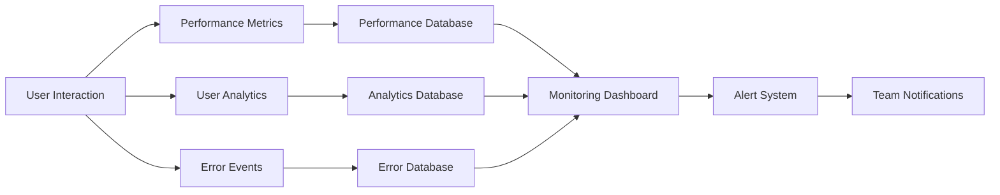

# Parsify.dev Post-Deployment Monitoring & Validation

**Project**: Developer Tools Platform Expansion  
**Version**: 1.0.0  
**Date**: 2025-01-11  
**Environment**: Production (https://parsify.dev)  

---

## 🎯 Overview

This document defines comprehensive post-deployment monitoring and validation procedures for the Parsify.dev developer tools platform. The procedures ensure optimal performance, user experience, and business success after deployment to production.

---

## 📊 Monitoring Architecture

### System Components
```
┌─────────────────┐    ┌─────────────────┐    ┌─────────────────┐
│   Frontend      │    │   Analytics     │    │   Monitoring    │
│   (Next.js)     │───▶│   (Google)      │───▶│   (Sentry)      │
└─────────────────┘    └─────────────────┘    └─────────────────┘
         │                       │                       │
         ▼                       ▼                       ▼
┌─────────────────┐    ┌─────────────────┐    ┌─────────────────┐
│   Performance   │    │   User Behavior │    │   Error Tracking│
│   (Core Web Vitals)│  │   (Hotjar)      │    │   (Sentry)      │
└─────────────────┘    └─────────────────┘    └─────────────────┘
         │                       │                       │
         ▼                       ▼                       ▼
┌─────────────────┐    ┌─────────────────┐    ┌─────────────────┐
│   Accessibility │    │   Uptime        │    │   Alerts        │
│   (axe-core)    │    │   (Pingdom)     │    │   (PagerDuty)   │
└─────────────────┘    └─────────────────┘    └─────────────────┘
```

### Data Collection Pipeline


---

## 🔍 Real-Time Monitoring Procedures

### Phase 1: Immediate Post-Deployment (T+0 to T+2 hours)

#### 1.1 Automated Health Checks
```bash
#!/bin/bash
# Health Check Script - health-monitor.sh
# Run continuously for first 2 hours

DOMAIN="parsify.dev"
CHECK_INTERVAL=30  # seconds
FAILURE_THRESHOLD=3
ROLLBACK_THRESHOLD=5

failure_count=0
monitoring_duration=7200  # 2 hours
start_time=$(date +%s)

while [ $(( $(date +%s) - start_time )) -lt $monitoring_duration ]; do
    timestamp=$(date '+%Y-%m-%d %H:%M:%S')
    
    # Main health check
    if curl -f -s --max-time 10 "https://$DOMAIN/api/health" > /dev/null 2>&1; then
        echo "[$timestamp] ✅ Health check passed"
        failure_count=0
    else
        echo "[$timestamp] ❌ Health check failed"
        failure_count=$((failure_count + 1))
        
        if [ $failure_count -ge $ROLLBACK_THRESHOLD ]; then
            echo "[$timestamp] 🚨 ROLLBACK TRIGGERED - $failure_count consecutive failures"
            # Execute rollback
            ./scripts/emergency-rollback.sh "Health check threshold exceeded"
            exit 1
        fi
    fi
    
    # Secondary checks
    endpoints=(
        "https://$DOMAIN/"
        "https://$DOMAIN/tools"
        "https://$DOMAIN/api/search?q=test"
    )
    
    endpoint_failures=0
    for endpoint in "${endpoints[@]}"; do
        if ! curl -f -s --max-time 5 "$endpoint" > /dev/null 2>&1; then
            endpoint_failures=$((endpoint_failures + 1))
        fi
    done
    
    if [ $endpoint_failures -gt 0 ]; then
        echo "[$timestamp] ⚠️  $endpoint_failures endpoint(s) failing"
    fi
    
    sleep $CHECK_INTERVAL
done

echo "[$timestamp] 🏁 Monitoring period completed successfully"
```

#### 1.2 Performance Monitoring Setup
```javascript
// Performance Monitor - performance-monitor.js
class PostDeploymentPerformanceMonitor {
  constructor() {
    this.metrics = {
      fcp: [],      // First Contentful Paint
      lcp: [],      // Largest Contentful Paint
      fid: [],      // First Input Delay
      cls: [],      // Cumulative Layout Shift
      ttfb: [],     // Time to First Byte
      domLoad: [],  // DOM Load Time
      windowLoad: [] // Window Load Time
    };
    
    this.thresholds = {
      fcp: 1800,    // 1.8s
      lcp: 2500,    // 2.5s
      fid: 100,     // 100ms
      cls: 0.1,     // 0.1
      ttfb: 600,    // 600ms
      domLoad: 3000, // 3s
      windowLoad: 4000 // 4s
    };
    
    this.initializeMetrics();
  }
  
  initializeMetrics() {
    // Core Web Vitals
    this.observeFCP();
    this.observeLCP();
    this.observeFID();
    this.observeCLS();
    
    // Traditional metrics
    this.observeNavigation();
    
    // Resource metrics
    this.observeResources();
  }
  
  observeFCP() {
    new PerformanceObserver((entryList) => {
      const entries = entryList.getEntries();
      const fcp = entries[entries.length - 1];
      
      this.metrics.fcp.push({
        value: fcp.startTime,
        timestamp: Date.now()
      });
      
      this.checkThreshold('FCP', fcp.startTime, this.thresholds.fcp);
    }).observe({ entryTypes: ['paint'] });
  }
  
  observeLCP() {
    new PerformanceObserver((entryList) => {
      const entries = entryList.getEntries();
      const lcp = entries[entries.length - 1];
      
      this.metrics.lcp.push({
        value: lcp.startTime,
        timestamp: Date.now()
      });
      
      this.checkThreshold('LCP', lcp.startTime, this.thresholds.lcp);
    }).observe({ entryTypes: ['largest-contentful-paint'] });
  }
  
  observeFID() {
    new PerformanceObserver((entryList) => {
      const entries = entryList.getEntries();
      entries.forEach(entry => {
        this.metrics.fid.push({
          value: entry.processingStart - entry.startTime,
          timestamp: Date.now()
        });
        
        this.checkThreshold('FID', entry.processingStart - entry.startTime, this.thresholds.fid);
      });
    }).observe({ entryTypes: ['first-input'] });
  }
  
  observeCLS() {
    let clsValue = 0;
    
    new PerformanceObserver((entryList) => {
      const entries = entryList.getEntries();
      entries.forEach(entry => {
        if (!entry.hadRecentInput) {
          clsValue += entry.value;
        }
      });
      
      this.metrics.cls.push({
        value: clsValue,
        timestamp: Date.now()
      });
      
      this.checkThreshold('CLS', clsValue, this.thresholds.cls);
    }).observe({ entryTypes: ['layout-shift'] });
  }
  
  observeNavigation() {
    window.addEventListener('load', () => {
      const navigation = performance.getEntriesByType('navigation')[0];
      
      this.metrics.ttfb.push({
        value: navigation.responseStart - navigation.requestStart,
        timestamp: Date.now()
      });
      
      this.metrics.domLoad.push({
        value: navigation.domContentLoadedEventEnd - navigation.navigationStart,
        timestamp: Date.now()
      });
      
      this.metrics.windowLoad.push({
        value: navigation.loadEventEnd - navigation.navigationStart,
        timestamp: Date.now()
      });
    });
  }
  
  observeResources() {
    new PerformanceObserver((entryList) => {
      const entries = entryList.getEntries();
      entries.forEach(entry => {
        if (entry.duration > 5000) { // Resources taking >5s
          console.warn(`Slow resource detected: ${entry.name} - ${entry.duration}ms`);
          this.reportSlowResource(entry);
        }
      });
    }).observe({ entryTypes: ['resource'] });
  }
  
  checkThreshold(metric, value, threshold) {
    if (value > threshold) {
      this.reportPerformanceIssue(metric, value, threshold);
    }
  }
  
  reportPerformanceIssue(metric, value, threshold) {
    const issue = {
      metric,
      value,
      threshold,
      url: window.location.href,
      userAgent: navigator.userAgent,
      timestamp: new Date().toISOString()
    };
    
    // Send to monitoring service
    this.sendToMonitoring(issue);
    
    // Console warning
    console.warn(`🐌 Performance Alert: ${metric} (${value}ms) exceeds threshold (${threshold}ms)`);
  }
  
  reportSlowResource(entry) {
    const resource = {
      name: entry.name,
      duration: entry.duration,
      size: entry.transferSize,
      type: entry.initiatorType,
      timestamp: new Date().toISOString()
    };
    
    this.sendToMonitoring(resource);
  }
  
  sendToMonitoring(data) {
    // Send to your monitoring service (Sentry, etc.)
    if (typeof window !== 'undefined' && window.Sentry) {
      window.Sentry.captureMessage('Performance Issue', {
        level: 'warning',
        tags: { type: 'performance' },
        extra: data
      });
    }
  }
  
  getMetricsReport() {
    const report = {
      timestamp: new Date().toISOString(),
      metrics: {}
    };
    
    Object.keys(this.metrics).forEach(metric => {
      const values = this.metrics[metric].map(m => m.value);
      if (values.length > 0) {
        report.metrics[metric] = {
          count: values.length,
          min: Math.min(...values),
          max: Math.max(...values),
          avg: values.reduce((a, b) => a + b, 0) / values.length,
          p75: this.percentile(values, 75),
          p95: this.percentile(values, 95)
        };
      }
    });
    
    return report;
  }
  
  percentile(arr, p) {
    const sorted = arr.sort((a, b) => a - b);
    const index = Math.ceil((p / 100) * sorted.length) - 1;
    return sorted[index];
  }
}

// Initialize monitoring
const performanceMonitor = new PostDeploymentPerformanceMonitor();

// Generate report every 5 minutes
setInterval(() => {
  const report = performanceMonitor.getMetricsReport();
  console.log('Performance Report:', report);
  
  // Send report to analytics
  if (typeof fetch !== 'undefined') {
    fetch('/api/metrics/performance', {
      method: 'POST',
      headers: { 'Content-Type': 'application/json' },
      body: JSON.stringify(report)
    });
  }
}, 300000);
```

#### 1.3 User Experience Monitoring
```javascript
// User Experience Monitor - ux-monitor.js
class UserExperienceMonitor {
  constructor() {
    this.interactions = [];
    this.errors = [];
    this.toolUsage = {};
    this.sessionStart = Date.now();
    
    this.initializeTracking();
  }
  
  initializeTracking() {
    // Track tool usage
    this.trackToolUsage();
    
    // Track user interactions
    this.trackInteractions();
    
    // Track errors
    this.trackErrors();
    
    // Track session duration
    this.trackSessionDuration();
  }
  
  trackToolUsage() {
    // Track tool page views
    const observer = new MutationObserver((mutations) => {
      mutations.forEach(() => {
        const toolName = this.extractToolName();
        if (toolName) {
          this.recordToolUsage(toolName);
        }
      });
    });
    
    observer.observe(document.body, {
      childList: true,
      subtree: true
    });
  }
  
  extractToolName() {
    // Extract tool name from URL or page content
    const urlParts = window.location.pathname.split('/');
    if (urlParts[1] === 'tools' && urlParts[2]) {
      return urlParts[2];
    }
    return null;
  }
  
  recordToolUsage(toolName) {
    if (!this.toolUsage[toolName]) {
      this.toolUsage[toolName] = {
        visits: 0,
        totalTime: 0,
        lastVisit: null
      };
    }
    
    this.toolUsage[toolName].visits += 1;
    this.toolUsage[toolName].lastVisit = Date.now();
  }
  
  trackInteractions() {
    // Track button clicks, form submissions, etc.
    document.addEventListener('click', (event) => {
      const target = event.target;
      const interaction = {
        type: 'click',
        element: this.getElementDescription(target),
        timestamp: Date.now(),
        url: window.location.href
      };
      
      this.interactions.push(interaction);
      this.throttledReport();
    });
    
    // Track form submissions
    document.addEventListener('submit', (event) => {
      const interaction = {
        type: 'form_submit',
        element: this.getElementDescription(event.target),
        timestamp: Date.now(),
        url: window.location.href
      };
      
      this.interactions.push(interaction);
    });
  }
  
  getElementDescription(element) {
    if (element.id) return `#${element.id}`;
    if (element.className) return `.${element.className.split(' ').join('.')}`;
    if (element.tagName) return element.tagName.toLowerCase();
    return 'unknown';
  }
  
  trackErrors() {
    // Track JavaScript errors
    window.addEventListener('error', (event) => {
      const error = {
        message: event.message,
        filename: event.filename,
        lineno: event.lineno,
        colno: event.colno,
        timestamp: Date.now(),
        url: window.location.href,
        userAgent: navigator.userAgent
      };
      
      this.errors.push(error);
      this.reportError(error);
    });
    
    // Track unhandled promise rejections
    window.addEventListener('unhandledrejection', (event) => {
      const error = {
        message: event.reason?.message || 'Unhandled promise rejection',
        stack: event.reason?.stack,
        timestamp: Date.now(),
        url: window.location.href,
        type: 'promise_rejection'
      };
      
      this.errors.push(error);
      this.reportError(error);
    });
  }
  
  trackSessionDuration() {
    // Report session duration every minute
    setInterval(() => {
      const duration = Date.now() - this.sessionStart;
      this.reportSessionDuration(duration);
    }, 60000);
  }
  
  throttledReport() {
    // Report interactions every 10 interactions or every 30 seconds
    if (this.interactions.length >= 10) {
      this.reportInteractions();
    }
  }
  
  reportInteractions() {
    if (this.interactions.length === 0) return;
    
    const data = {
      interactions: this.interactions.splice(0), // Clear after sending
      timestamp: Date.now()
    };
    
    this.sendToAnalytics('interactions', data);
  }
  
  reportError(error) {
    // Send error to monitoring service
    if (typeof window !== 'undefined' && window.Sentry) {
      window.Sentry.captureException(error);
    }
    
    this.sendToAnalytics('errors', { error, timestamp: Date.now() });
  }
  
  reportSessionDuration(duration) {
    this.sendToAnalytics('session_duration', {
      duration,
      url: window.location.href,
      timestamp: Date.now()
    });
  }
  
  sendToAnalytics(type, data) {
    if (typeof fetch !== 'undefined') {
      fetch(`/api/analytics/${type}`, {
        method: 'POST',
        headers: { 'Content-Type': 'application/json' },
        body: JSON.stringify(data)
      }).catch(err => {
        console.warn('Failed to send analytics:', err);
      });
    }
  }
  
  getUXReport() {
    return {
      sessionDuration: Date.now() - this.sessionStart,
      toolUsage: this.toolUsage,
      interactionCount: this.interactions.length,
      errorCount: this.errors.length,
      timestamp: new Date().toISOString()
    };
  }
}

// Initialize UX monitoring
const uxMonitor = new UserExperienceMonitor();

// Send UX report every 5 minutes
setInterval(() => {
  const report = uxMonitor.getUXReport();
  
  if (typeof fetch !== 'undefined') {
    fetch('/api/analytics/ux-report', {
      method: 'POST',
      headers: { 'Content-Type': 'application/json' },
      body: JSON.stringify(report)
    });
  }
}, 300000);
```

### Phase 2: Extended Monitoring (T+2 hours to T+24 hours)

#### 2.1 Automated Monitoring Scripts
```bash
#!/bin/bash
# Extended Health Monitor - extended-monitor.sh
# Runs for 24 hours with comprehensive checks

DOMAIN="parsify.dev"
CHECK_INTERVAL=300  # 5 minutes
DETAILED_CHECK_INTERVAL=3600  # 1 hour
REPORT_INTERVAL=1800  # 30 minutes
LOG_FILE="monitoring-$(date +%Y%m%d).log"

# Initialize counters
total_checks=0
successful_checks=0
failed_checks=0
warnings=0

# Performance thresholds
PERFORMANCE_THRESHOLDS={
  "response_time": 5000,
  "dom_size": 1500000,
  "resource_count": 100,
  "bundle_size": 500000
}

log() {
  echo "[$(date '+%Y-%m-%d %H:%M:%S')] $1" | tee -a "$LOG_FILE"
}

check_health() {
  local url="https://$DOMAIN/api/health"
  local start_time=$(date +%s%3N)
  
  if curl -f -s --max-time 10 "$url" > /dev/null 2>&1; then
    local end_time=$(date +%s%3N)
    local response_time=$((end_time - start_time))
    
    if [ $response_time -gt ${PERFORMANCE_THRESHOLDS[response_time]} ]; then
      log "⚠️  Slow response: ${response_time}ms"
      warnings=$((warnings + 1))
    fi
    
    log "✅ Health check passed (${response_time}ms)"
    successful_checks=$((successful_checks + 1))
    return 0
  else
    log "❌ Health check failed"
    failed_checks=$((failed_checks + 1))
    return 1
  fi
}

check_tool_functionality() {
  local tools=(
    "json/formatter"
    "code/executor"
    "file/converter"
    "text/encoder"
    "security/hash-generator"
  )
  
  local tool_failures=0
  
  for tool in "${tools[@]}"; do
    local url="https://$DOMAIN/tools/$tool"
    if ! curl -f -s --max-time 10 "$url" > /dev/null 2>&1; then
      log "⚠️  Tool page failing: $tool"
      tool_failures=$((tool_failures + 1))
    fi
  done
  
  if [ $tool_failures -gt 0 ]; then
    log "❌ $tool_failures tool(s) failing"
    return 1
  fi
  
  return 0
}

check_performance() {
  # Use Lighthouse CLI for performance testing
  if command -v lighthouse >/dev/null 2>&1; then
    local lighthouse_report="lighthouse-$(date +%s).json"
    
    lighthouse "https://$DOMAIN" \
      --output=json \
      --output-path="$lighthouse_report" \
      --chrome-flags="--headless" \
      --quiet
    
    # Extract performance score
    local performance_score=$(jq '.categories.performance.score * 100' "$lighthouse_report")
    
    if (( $(echo "$performance_score < 90" | bc -l) )); then
      log "⚠️  Low Lighthouse score: $performance_score"
      warnings=$((warnings + 1))
    else
      log "✅ Good Lighthouse score: $performance_score"
    fi
    
    rm "$lighthouse_report"
  fi
}

check_accessibility() {
  # Use axe-core for accessibility testing
  if command -v axe >/dev/null 2>&1; then
    local accessibility_report="axe-$(date +%s).json"
    
    axe "https://$DOMAIN" --tags wcag2aa,wcag21aa > "$accessibility_report"
    
    # Count violations
    local violations=$(jq '.violations | length' "$accessibility_report")
    
    if [ "$violations" -gt 0 ]; then
      log "⚠️  $violations accessibility violation(s)"
      warnings=$((warnings + 1))
    else
      log "✅ No accessibility violations"
    fi
    
    rm "$accessibility_report"
  fi
}

generate_report() {
  local uptime_percentage=$((successful_checks * 100 / total_checks))
  
  log "📊 Monitoring Report"
  log "Total checks: $total_checks"
  log "Successful: $successful_checks"
  log "Failed: $failed_checks"
  log "Warnings: $warnings"
  log "Uptime: ${uptime_percentage}%"
  
  # Send to monitoring service
  curl -X POST "https://api.parsify.dev/monitoring/report" \
    -H "Content-Type: application/json" \
    -d "{
      \"timestamp\": \"$(date -u +%Y-%m-%dT%H:%M:%SZ)\",
      \"total_checks\": $total_checks,
      \"successful_checks\": $successful_checks,
      \"failed_checks\": $failed_checks,
      \"warnings\": $warnings,
      \"uptime_percentage\": $uptime_percentage,
      \"domain\": \"$DOMAIN\"
    }"
}

# Main monitoring loop
monitoring_duration=86400  # 24 hours
start_time=$(date +%s)

log "🚀 Starting extended monitoring for 24 hours"

while [ $(( $(date +%s) - start_time )) -lt $monitoring_duration ]; do
  total_checks=$((total_checks + 1))
  
  # Basic health check
  if check_health; then
    # Detailed checks every hour
    if [ $((total_checks % 12)) -eq 0 ]; then
      log "🔍 Running detailed checks..."
      check_tool_functionality
      check_performance
      check_accessibility
    fi
  fi
  
  # Generate report every 30 minutes
  if [ $((total_checks % 6)) -eq 0 ]; then
    generate_report
  fi
  
  sleep $CHECK_INTERVAL
done

log "🏁 Extended monitoring completed"
generate_report
```

#### 2.2 Business Metrics Monitoring
```javascript
// Business Metrics Monitor - business-metrics.js
class BusinessMetricsMonitor {
  constructor() {
    this.metrics = {
      toolUsage: {},
      userSessions: [],
      conversions: {},
      satisfaction: [],
      performance: {}
    };
    
    this.initializeBusinessTracking();
  }
  
  initializeBusinessTracking() {
    this.trackToolConversionRates();
    this.trackUserEngagement();
    this.trackPerformanceImpact();
    this.trackUserSatisfaction();
  }
  
  trackToolConversionRates() {
    // Track tool completion rates
    const observer = new MutationObserver(() => {
      const toolName = this.extractToolName();
      if (toolName && !this.metrics.toolUsage[toolName]) {
        this.metrics.toolUsage[toolName] = {
          visits: 0,
          completions: 0,
          errors: 0,
          averageTime: 0
        };
        
        // Track tool completion
        this.trackToolCompletion(toolName);
      }
    });
    
    observer.observe(document.body, { childList: true, subtree: true });
  }
  
  trackToolCompletion(toolName) {
    let startTime = null;
    
    // Track when user starts using tool
    const startButtons = document.querySelectorAll('[data-tool-start]');
    startButtons.forEach(button => {
      button.addEventListener('click', () => {
        startTime = Date.now();
        this.metrics.toolUsage[toolName].visits += 1;
      });
    });
    
    // Track when user completes tool operation
    const completeButtons = document.querySelectorAll('[data-tool-complete]');
    completeButtons.forEach(button => {
      button.addEventListener('click', () => {
        if (startTime) {
          const completionTime = Date.now() - startTime;
          this.updateToolMetrics(toolName, completionTime, true);
        }
      });
    });
  }
  
  updateToolMetrics(toolName, completionTime, success) {
    const tool = this.metrics.toolUsage[toolName];
    
    if (success) {
      tool.completions += 1;
      
      // Update average time
      const totalCompletions = tool.completions;
      tool.averageTime = ((tool.averageTime * (totalCompletions - 1)) + completionTime) / totalCompletions;
    } else {
      tool.errors += 1;
    }
  }
  
  trackUserEngagement() {
    // Track session duration
    const sessionStart = Date.now();
    
    // Track page visibility changes
    document.addEventListener('visibilitychange', () => {
      if (document.hidden) {
        this.recordSessionEnd(Date.now() - sessionStart);
      }
    });
    
    // Track scroll depth
    let maxScrollDepth = 0;
    window.addEventListener('scroll', () => {
      const scrollDepth = Math.round(
        (window.scrollY + window.innerHeight) / document.body.scrollHeight * 100
      );
      maxScrollDepth = Math.max(maxScrollDepth, scrollDepth);
    });
    
    // Record scroll depth when user leaves
    window.addEventListener('beforeunload', () => {
      this.recordScrollDepth(maxScrollDepth);
    });
  }
  
  recordSessionEnd(duration) {
    this.metrics.userSessions.push({
      duration,
      timestamp: Date.now(),
      url: window.location.href
    });
  }
  
  recordScrollDepth(depth) {
    this.sendToAnalytics('scroll_depth', {
      depth,
      url: window.location.href,
      timestamp: Date.now()
    });
  }
  
  trackPerformanceImpact() {
    // Correlate performance with user satisfaction
    if (window.performance && window.performance.getEntriesByType) {
      const navigationEntries = window.performance.getEntriesByType('navigation');
      
      if (navigationEntries.length > 0) {
        const navEntry = navigationEntries[0];
        const loadTime = navEntry.loadEventEnd - navEntry.loadEventStart;
        
        this.recordPerformanceImpact(loadTime);
      }
    }
  }
  
  recordPerformanceImpact(loadTime) {
    // Categorize performance impact
    let impact = 'good';
    if (loadTime > 5000) impact = 'poor';
    else if (loadTime > 3000) impact = 'fair';
    
    this.sendToAnalytics('performance_impact', {
      loadTime,
      impact,
      url: window.location.href,
      timestamp: Date.now()
    });
  }
  
  trackUserSatisfaction() {
    // Track user satisfaction signals
    let errors = 0;
    let interactions = 0;
    
    // Error signals
    window.addEventListener('error', () => {
      errors += 1;
    });
    
    // Engagement signals
    document.addEventListener('click', () => {
      interactions += 1;
    });
    
    // Calculate satisfaction score when session ends
    window.addEventListener('beforeunload', () => {
      const satisfactionScore = this.calculateSatisfactionScore(errors, interactions);
      this.recordSatisfactionScore(satisfactionScore);
    });
  }
  
  calculateSatisfactionScore(errors, interactions) {
    // Simple satisfaction calculation
    const errorRatio = errors / Math.max(interactions, 1);
    const interactionBonus = Math.min(interactions / 10, 1);
    
    return Math.max(0, Math.min(5, (1 - errorRatio) * 4 + interactionBonus));
  }
  
  recordSatisfactionScore(score) {
    this.metrics.satisfaction.push({
      score,
      timestamp: Date.now(),
      url: window.location.href
    });
  }
  
  generateBusinessReport() {
    const report = {
      timestamp: new Date().toISOString(),
      toolUsage: this.calculateToolUsageMetrics(),
      userEngagement: this.calculateUserEngagementMetrics(),
      performanceImpact: this.calculatePerformanceImpactMetrics(),
      satisfaction: this.calculateSatisfactionMetrics()
    };
    
    return report;
  }
  
  calculateToolUsageMetrics() {
    const tools = Object.keys(this.metrics.toolUsage);
    const toolMetrics = {};
    
    tools.forEach(tool => {
      const usage = this.metrics.toolUsage[tool];
      const completionRate = usage.visits > 0 ? usage.completions / usage.visits : 0;
      const errorRate = usage.visits > 0 ? usage.errors / usage.visits : 0;
      
      toolMetrics[tool] = {
        visits: usage.visits,
        completions: usage.completions,
        errors: usage.errors,
        completionRate: Math.round(completionRate * 100),
        errorRate: Math.round(errorRate * 100),
        averageTime: Math.round(usage.averageTime)
      };
    });
    
    return toolMetrics;
  }
  
  calculateUserEngagementMetrics() {
    const sessions = this.metrics.userSessions;
    
    if (sessions.length === 0) return {};
    
    const durations = sessions.map(s => s.duration);
    const averageDuration = durations.reduce((a, b) => a + b, 0) / durations.length;
    
    return {
      totalSessions: sessions.length,
      averageSessionDuration: Math.round(averageDuration),
      longestSession: Math.max(...durations),
      shortestSession: Math.min(...durations)
    };
  }
  
  calculatePerformanceImpactMetrics() {
    // Calculate performance satisfaction correlation
    const satisfactionScores = this.metrics.satisfaction;
    
    return {
      averageSatisfaction: this.calculateAverage(satisfactionScores.map(s => s.score)),
      totalSatisfactionRecords: satisfactionScores.length,
      satisfactionDistribution: this.calculateDistribution(satisfactionScores.map(s => s.score))
    };
  }
  
  calculateSatisfactionMetrics() {
    const scores = this.metrics.satisfaction.map(s => s.score);
    
    return {
      averageScore: this.calculateAverage(scores),
      totalResponses: scores.length,
      distribution: this.calculateDistribution(scores)
    };
  }
  
  calculateAverage(values) {
    return values.length > 0 ? values.reduce((a, b) => a + b, 0) / values.length : 0;
  }
  
  calculateDistribution(values) {
    const distribution = { 1: 0, 2: 0, 3: 0, 4: 0, 5: 0 };
    
    values.forEach(value => {
      const bucket = Math.round(value);
      if (bucket >= 1 && bucket <= 5) {
        distribution[bucket]++;
      }
    });
    
    return distribution;
  }
  
  sendToAnalytics(type, data) {
    if (typeof fetch !== 'undefined') {
      fetch(`/api/analytics/${type}`, {
        method: 'POST',
        headers: { 'Content-Type': 'application/json' },
        body: JSON.stringify(data)
      }).catch(err => {
        console.warn('Failed to send analytics:', err);
      });
    }
  }
}

// Initialize business metrics monitoring
const businessMonitor = new BusinessMetricsMonitor();

// Send business report every hour
setInterval(() => {
  const report = businessMonitor.generateBusinessReport();
  
  if (typeof fetch !== 'undefined') {
    fetch('/api/analytics/business-report', {
      method: 'POST',
      headers: { 'Content-Type': 'application/json' },
      body: JSON.stringify(report)
    });
  }
}, 3600000);
```

---

## 📈 Dashboard & Alerting Setup

### Monitoring Dashboard Configuration
```yaml
# monitoring-dashboard.yml
dashboard:
  title: "Parsify.dev Production Monitoring"
  refresh_interval: 30s
  
  panels:
    - title: "System Health"
      type: "status"
      metrics:
        - name: "Uptime"
          query: "100 - (error_rate * 100)"
          unit: "percentage"
          thresholds:
            - value: 99.9
              color: "green"
            - value: 99.0
              color: "yellow"
            - value: 95.0
              color: "red"
    
    - title: "Response Time"
      type: "graph"
      metrics:
        - name: "Average Response Time"
          query: "avg(response_time)"
          unit: "milliseconds"
          thresholds:
            - value: 1000
              color: "green"
            - value: 3000
              color: "yellow"
            - value: 5000
              color: "red"
    
    - title: "Error Rate"
      type: "graph"
      metrics:
        - name: "Error Rate"
          query: "sum(errors) / sum(requests)"
          unit: "percentage"
          thresholds:
            - value: 1
              color: "green"
            - value: 5
              color: "yellow"
            - value: 10
              color: "red"
    
    - title: "Core Web Vitals"
      type: "gauge"
      metrics:
        - name: "LCP"
          query: "avg(lcp)"
          unit: "milliseconds"
          max: 4000
          thresholds:
            - value: 2500
              color: "green"
            - value: 4000
              color: "red"
        
        - name: "FID"
          query: "avg(fid)"
          unit: "milliseconds"
          max: 300
          thresholds:
            - value: 100
              color: "green"
            - value: 300
              color: "red"
        
        - name: "CLS"
          query: "avg(cls)"
          unit: "score"
          max: 0.25
          thresholds:
            - value: 0.1
              color: "green"
            - value: 0.25
              color: "red"
    
    - title: "Tool Usage"
      type: "table"
      metrics:
        - name: "Tool"
          query: "group_by(tool_name)"
        - name: "Visits"
          query: "count(distinct session_id) by tool_name"
        - name: "Completions"
          query: "count(tool_completion) by tool_name"
        - name: "Completion Rate"
          query: "count(tool_completion) / count(distinct session_id) by tool_name"
          unit: "percentage"
    
    - title: "User Satisfaction"
      type: "gauge"
      metrics:
        - name: "Satisfaction Score"
          query: "avg(satisfaction_score)"
          unit: "score"
          max: 5
          min: 1
          thresholds:
            - value: 4.5
              color: "green"
            - value: 3.5
              color: "yellow"
            - value: 2.5
              color: "red"
```

### Alert Configuration
```yaml
# alerts.yml
alerts:
  - name: "High Error Rate"
    condition: "error_rate > 5%"
    duration: "5m"
    severity: "critical"
    message: "Error rate is {{error_rate}}% (threshold: 5%)"
    actions:
      - type: "slack"
        channel: "#alerts"
      - type: "email"
        recipients: ["devops@parsify.dev"]
      - type: "pagerduty"
        service: "parsify-prod"
  
  - name: "Slow Response Time"
    condition: "avg(response_time) > 5s"
    duration: "10m"
    severity: "warning"
    message: "Average response time is {{response_time}}ms (threshold: 5000ms)"
    actions:
      - type: "slack"
        channel: "#performance"
      - type: "email"
        recipients: ["performance@parsify.dev"]
  
  - name: "Low Satisfaction Score"
    condition: "avg(satisfaction_score) < 3.0"
    duration: "30m"
    severity: "warning"
    message: "User satisfaction score is {{satisfaction_score}} (threshold: 3.0)"
    actions:
      - type: "slack"
        channel: "#product"
      - type: "email"
        recipients: ["product@parsify.dev"]
  
  - name: "Service Outage"
    condition: "uptime < 95%"
    duration: "1m"
    severity: "critical"
    message: "Service outage detected. Uptime: {{uptime}}%"
    actions:
      - type: "slack"
        channel: "#emergency"
      - type: "email"
        recipients: ["emergency@parsify.dev"]
      - type: "pagerduty"
        service: "parsify-emergency"
        escalation: true
```

---

## 📋 Validation Checklists

### Immediate Validation (First 30 Minutes)
```markdown
## Immediate Post-Deployment Validation Checklist

### Technical Validation
- [ ] Homepage loads within 3 seconds
- [ ] All API endpoints responding (<5s)
- [ ] No console errors on critical pages
- [ ] Bundle size under 500KB
- [ ] SSL certificate valid
- [ ] DNS propagation complete
- [ ] CDN caching working

### Functional Validation
- [ ] Tools page loads and displays categories
- [ ] JSON tools (all 11) functional
- [ ] Code tools (all 8) functional  
- [ ] File tools (all 8) functional
- [ ] Network tools (all 6) functional
- [ ] Text tools (all 9) functional
- [ ] Security tools (all 8) functional
- [ ] Search functionality working
- [ ] Mobile responsive design

### Performance Validation
- [ ] Lighthouse score ≥90
- [ ] Core Web Vitals within thresholds
- [ ] Memory usage <90%
- [ ] CPU usage <80%
- [ ] Error rate <1%

### Business Validation
- [ ] Analytics tracking active
- [ ] User sessions being recorded
- [ ] Tool usage tracking working
- [ ] Error tracking functional
- [ ] Performance monitoring active
```

### Extended Validation (First 24 Hours)
```markdown
## Extended Validation Checklist

### Continuous Monitoring
- [ ] Automated health checks running
- [ ] Performance metrics collected
- [ ] Error tracking active
- [ ] User analytics captured
- [ ] Accessibility monitoring active
- [ ] Uptime monitoring functional

### Business Metrics
- [ ] User traffic patterns normal
- [ ] Tool usage within expected ranges
- [ ] Error rate acceptable (<5%)
- [ ] User satisfaction ≥4.0
- [ ] Completion rate ≥95%
- [ ] Support ticket volume normal

### Performance Trends
- [ ] Response time stable (<3s)
- [ ] Bundle size consistent
- [ ] Memory usage stable
- [ ] CPU usage normal
- [ ] No performance degradation
- [ ] Core Web Vitals stable

### User Experience
- [ ] No user complaints received
- [ ] Social media sentiment positive
- [ ] Tool completion rates high
- [ ] Session duration expected
- [ ] Bounce rate acceptable
- [ ] Mobile experience good
```

### Weekly Validation (First Week)
```markdown
## Weekly Validation Checklist

### Performance Analysis
- [ ] Weekly performance report generated
- [ ] Trends analyzed and understood
- [ ] Optimization opportunities identified
- [ ] Performance budget maintained
- [ ] No regressions detected

### Business Impact
- [ ] User adoption metrics met
- [ ] Tool usage goals achieved
- [ ] Customer satisfaction targets met
- [ ] Support volume manageable
- [ ] Revenue impact positive (if applicable)

### Technical Health
- [ ] No security vulnerabilities
- [ ] Dependency updates applied
- [ ] Backup systems working
- [ ] Monitoring systems stable
- [ ] Documentation updated

### User Feedback
- [ ] User feedback collected
- [ ] Issues documented and prioritized
- [ ] Improvement suggestions recorded
- [ ] Success stories captured
- [ ] Competitive analysis completed
```

---

## 🚨 Incident Response Procedures

### Alert Classification
```yaml
alert_levels:
  critical:
    response_time: "< 5 minutes"
    impact: "Service outage or critical functionality broken"
    escalation: "Immediate"
    actions:
      - "Alert incident response team"
      - "Execute emergency rollback if needed"
      - "Notify stakeholders"
      - "Update status page"
  
  high:
    response_time: "< 15 minutes"
    impact: "Significant functionality issues"
    escalation: "Within 15 minutes"
    actions:
      - "Alert on-call engineer"
      - "Begin investigation"
      - "Prepare rollback plan"
      - "Monitor closely"
  
  medium:
    response_time: "< 1 hour"
    impact: "Minor functionality or performance issues"
    escalation: "Within 1 hour"
    actions:
      - "Create ticket"
      - "Schedule investigation"
      - "Monitor impact"
      - "Plan fix"
  
  low:
    response_time: "< 24 hours"
    impact: "Minor improvements or optimizations"
    escalation: "Within 24 hours"
    actions:
      - "Add to backlog"
      - "Schedule for next release"
      - "Document for reference"
```

### Communication Templates
```markdown
### Critical Incident Template
**INCIDENT**: [Brief description]
**SEVERITY**: Critical
**STATUS**: [Investigating/Identified/Monitoring/Resolved]
**STARTED**: [Timestamp]
**IMPACT**: [User impact description]

**CURRENT STATUS**:
[Details about current situation]

**ACTIONS IN PROGRESS**:
- [List of ongoing actions]

**ESTIMATED RESOLUTION**: [Timeframe]

**NEXT UPDATE**: [Time]

**CONTACT**: [Lead contact info]

---

### Resolution Update Template
**INCIDENT RESOLVED**: [Incident name]
**DURATION**: [Total incident duration]
**ROOT CAUSE**: [Technical explanation]
**IMPACT**: [Summary of user impact]
**RESOLUTION**: [Fix implemented]

**PREVENTIVE MEASURES**:
- [List of planned improvements]

**FOLLOW-UP**:
- [Post-incident review scheduled]
- [Documentation updated]
- [Monitoring enhanced]
```

---

## ✅ Success Metrics & KPIs

### Technical KPIs
```yaml
performance:
  - metric: "Page Load Time"
    target: "< 3 seconds"
    measurement: "Real User Monitoring"
    frequency: "Continuous"
  
  - metric: "Time to Interactive"
    target: "< 3.8 seconds"
    measurement: "Lighthouse"
    frequency: "Daily"
  
  - metric: "Error Rate"
    target: "< 1%"
    measurement: "Error tracking"
    frequency: "Continuous"
  
  - metric: "Availability"
    target: "99.9%"
    measurement: "Uptime monitoring"
    frequency: "Continuous"

quality:
  - metric: "Accessibility Score"
    target: "WCAG 2.1 AA compliant"
    measurement: "Automated testing"
    frequency: "Daily"
  
  - metric: "Bundle Size"
    target: "< 500KB"
    measurement: "Bundle analysis"
    frequency: "Per deployment"
  
  - metric: "Test Coverage"
    target: "> 90%"
    measurement: "Code coverage tools"
    frequency: "Per build"
```

### Business KPIs
```yaml
user_experience:
  - metric: "User Satisfaction"
    target: "≥ 4.5/5"
    measurement: "User surveys + analytics"
    frequency: "Weekly"
  
  - metric: "Task Completion Rate"
    target: "≥ 95%"
    measurement: "Tool completion tracking"
    frequency: "Daily"
  
  - metric: "Session Duration"
    target: "≥ 2 minutes"
    measurement: "Analytics"
    frequency: "Daily"

adoption:
  - metric: "Tool Usage Growth"
    target: "25% increase"
    measurement: "Tool usage analytics"
    frequency: "Monthly"
  
  - metric: "User Retention"
    target: "≥ 80% monthly active users"
    measurement: "User analytics"
    frequency: "Monthly"
  
  - metric: "Support Ticket Volume"
    target: "≤ 5% increase"
    measurement: "Support system"
    frequency: "Weekly"
```

---

**This monitoring and validation plan ensures comprehensive oversight of the Parsify.dev platform post-deployment.**

**Version**: 1.0.0  
**Last Updated**: 2025-01-11  
**Next Review**: 2025-02-11  
**Approved By**: _________________________