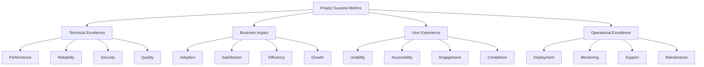

# Parsify.dev Success Criteria & Acceptance Metrics

**Project**: Developer Tools Platform Expansion  
**Version**: 1.0.0  
**Date**: 2025-01-11  
**Implementation**: T173 - Go-Live Checklist and Deployment Procedures  

---

## 🎯 Executive Summary

This document defines comprehensive success criteria and acceptance metrics for the Parsify.dev developer tools platform expansion. These metrics provide clear, measurable standards for evaluating project success across technical, business, user experience, and operational dimensions.

---

## 📊 Success Metrics Framework

### Metric Categories


---

## 🏆 Technical Success Criteria

### Performance Excellence

#### Core Web Vitals
```yaml
core_web_vitals:
  largest_contentful_paint_lcp:
    target: "< 2.5 seconds"
    measurement: "Chrome DevTools & Lighthouse"
    frequency: "Continuous monitoring"
    acceptance_criteria:
      good: "< 2.5s (75th percentile)"
      needs_improvement: "2.5s - 4.0s"
      poor: "> 4.0s"
    success_threshold: "90% of page loads must meet 'good' criteria"
  
  first_input_delay_fid:
    target: "< 100 milliseconds"
    measurement: "Real User Monitoring (RUM)"
    frequency: "Continuous monitoring"
    acceptance_criteria:
      good: "< 100ms (75th percentile)"
      needs_improvement: "100ms - 300ms"
      poor: "> 300ms"
    success_threshold: "95% of interactions must meet 'good' criteria"
  
  cumulative_layout_shift_cls:
    target: "< 0.1"
    measurement: "Layout shift monitoring"
    frequency: "Continuous monitoring"
    acceptance_criteria:
      good: "< 0.1"
      needs_improvement: "0.1 - 0.25"
      poor: "> 0.25"
    success_threshold: "95% of page loads must meet 'good' criteria"
```

#### General Performance Metrics
```yaml
general_performance:
  page_load_time:
    target: "< 3 seconds"
    measurement: "Page load timing"
    frequency: "Per deployment and continuous"
    acceptance_criteria:
      excellent: "< 1.5s"
      good: "1.5s - 3s"
      acceptable: "3s - 5s"
      poor: "> 5s"
    success_threshold: "90% of pages must load in under 3 seconds"
  
  time_to_interactive_tti:
    target: "< 3.8 seconds"
    measurement: "Performance API"
    frequency: "Continuous monitoring"
    acceptance_criteria:
      excellent: "< 2s"
      good: "2s - 3.8s"
      acceptable: "3.8s - 5s"
      poor: "> 5s"
    success_threshold: "85% of pages must be interactive within 3.8s"
  
  bundle_size:
    target: "< 500KB (gzipped)"
    measurement: "Bundle analyzer"
    frequency: "Per build"
    acceptance_criteria:
      excellent: "< 300KB"
      good: "300KB - 500KB"
      acceptable: "500KB - 750KB"
      poor: "> 750KB"
    success_threshold: "Initial bundle must not exceed 500KB gzipped"
```

### Reliability & Availability

#### Uptime & Accessibility
```yaml
reliability_metrics:
  uptime:
    target: "99.9% monthly uptime"
    measurement: "Uptime monitoring service"
    frequency: "Continuous"
    acceptance_criteria:
      excellent: "99.95%+"
      good: "99.9% - 99.95%"
      acceptable: "99.5% - 99.9%"
      poor: "< 99.5%"
    success_threshold: "Monthly uptime must be ≥99.9%"
  
  error_rate:
    target: "< 1% of all requests"
    measurement: "Error tracking system"
    frequency: "Continuous"
    acceptance_criteria:
      excellent: "< 0.1%"
      good: "0.1% - 1%"
      acceptable: "1% - 5%"
      poor: "> 5%"
    success_threshold: "Error rate must remain below 1%"
  
  mean_time_to_recovery_mttr:
    target: "< 5 minutes for critical issues"
    measurement: "Incident tracking system"
    frequency: "Per incident"
    acceptance_criteria:
      excellent: "< 2 minutes"
      good: "2 - 5 minutes"
      acceptable: "5 - 15 minutes"
      poor: "> 15 minutes"
    success_threshold: "Critical issues must be resolved within 5 minutes"
```

### Code Quality & Security

#### Code Quality Metrics
```yaml
code_quality:
  test_coverage:
    target: "≥ 90% coverage"
    measurement: "Code coverage tools"
    frequency: "Per build"
    acceptance_criteria:
      excellent: "≥ 95%"
      good: "90% - 95%"
      acceptable: "80% - 90%"
      poor: "< 80%"
    success_threshold: "All critical code paths must have ≥90% test coverage"
  
  technical_debt_ratio:
    target: "< 5% technical debt"
    measurement: "Static analysis tools"
    frequency: "Weekly"
    acceptance_criteria:
      excellent: "< 2%"
      good: "2% - 5%"
      acceptable: "5% - 10%"
      poor: "> 10%"
    success_threshold: "Technical debt must remain below 5%"
  
  code_complexity:
    target: "Low complexity"
    measurement: "Cyclomatic complexity analysis"
    frequency: "Per build"
    acceptance_criteria:
      excellent: "Average complexity < 5"
      good: "Average complexity 5-10"
      acceptable: "Average complexity 10-15"
      poor: "Average complexity > 15"
    success_threshold: "No functions should have complexity > 15"
```

#### Security Metrics
```yaml
security_metrics:
  vulnerability_scan:
    target: "Zero critical/high vulnerabilities"
    measurement: "Security scanning tools"
    frequency: "Weekly and per deployment"
    acceptance_criteria:
      excellent: "Zero vulnerabilities"
      good: "Only low severity vulnerabilities"
      acceptable: "Medium vulnerabilities with mitigation plan"
      poor: "Critical or high severity vulnerabilities"
    success_threshold: "Zero critical or high severity vulnerabilities"
  
  security_headers:
    target: "100% compliance"
    measurement: "Header security audit"
    frequency: "Monthly"
    acceptance_criteria:
      required_headers:
        - "Content-Security-Policy"
        - "X-Frame-Options"
        - "X-Content-Type-Options"
        - "Strict-Transport-Security"
    success_threshold: "All security headers must be properly configured"
  
  data_privacy:
    target: "Zero client-side data storage of sensitive information"
    measurement: "Code review and automated scanning"
    frequency: "Per deployment"
    acceptance_criteria:
      excellent: "No sensitive data stored client-side"
      good: "Minimal non-sensitive data client-side"
      poor: "Sensitive data stored client-side"
    success_threshold: "No sensitive user data stored in client-side storage"
```

---

## 💼 Business Success Criteria

### User Adoption & Engagement

#### User Growth Metrics
```yaml
user_adoption:
  monthly_active_users_mau:
    target: "25% increase in MAU within 3 months"
    measurement: "User analytics"
    frequency: "Monthly"
    acceptance_criteria:
      exceptional: "≥ 40% increase"
      excellent: "30% - 40% increase"
      good: "20% - 30% increase"
      acceptable: "10% - 20% increase"
      poor: "< 10% increase"
    success_threshold: "25% increase in MAU within 3 months"
  
  user_retention:
    target: "≥ 80% monthly retention rate"
    measurement: "Cohort analysis"
    frequency: "Monthly"
    acceptance_criteria:
      excellent: "≥ 85%"
      good: "80% - 85%"
      acceptable: "70% - 80%"
      poor: "< 70%"
    success_threshold: "80% of users must return within 30 days"
  
  new_user_acquisition:
    target: "20% increase in new user signups"
    measurement: "User registration data"
    frequency: "Monthly"
    acceptance_criteria:
      exceptional: "≥ 35% increase"
      excellent: "25% - 35% increase"
      good: "15% - 25% increase"
      acceptable: "5% - 15% increase"
      poor: "< 5% increase"
    success_threshold: "20% increase in new user signups"
```

#### Tool Usage Metrics
```yaml
tool_usage:
  tool_adoption_rate:
    target: "60% of active users use at least 3 different tools"
    measurement: "Tool usage analytics"
    frequency: "Monthly"
    acceptance_criteria:
      excellent: "≥ 75%"
      good: "60% - 75%"
      acceptable: "40% - 60%"
      poor: "< 40%"
    success_threshold: "60% of users must use multiple tools"
  
  most_used_tools:
    target: "JSON Formatter, Code Executor, Hash Generator in top 10"
    measurement: "Tool usage ranking"
    frequency: "Weekly"
    success_threshold: "Core tools must be among most frequently used"
  
  power_user_engagement:
    target: "15% of users become power users (10+ tools/month)"
    measurement: "User behavior analytics"
    frequency: "Monthly"
    acceptance_criteria:
      excellent: "≥ 20%"
      good: "15% - 20%"
      acceptable: "10% - 15%"
      poor: "< 10%"
    success_threshold: "15% of users must be power users"
```

### Customer Satisfaction

#### User Satisfaction Metrics
```yaml
customer_satisfaction:
  user_satisfaction_score:
    target: "≥ 4.5/5 average rating"
    measurement: "User surveys and feedback"
    frequency: "Quarterly"
    acceptance_criteria:
      exceptional: "≥ 4.7/5"
      excellent: "4.5 - 4.7/5"
      good: "4.0 - 4.5/5"
      acceptable: "3.5 - 4.0/5"
      poor: "< 3.5/5"
    success_threshold: "Average satisfaction score must be ≥4.5/5"
  
  net_promoter_score_nps:
    target: "≥ 50 NPS"
    measurement: "NPS surveys"
    frequency: "Quarterly"
    acceptance_criteria:
      excellent: "≥ 70"
      good: "50 - 70"
      acceptable: "30 - 50"
      poor: "< 30"
    success_threshold: "NPS must be ≥50"
  
  user_feedback_sentiment:
    target: "≥ 80% positive sentiment"
    measurement: "Sentiment analysis of feedback"
    frequency: "Weekly"
    acceptance_criteria:
      excellent: "≥ 90%"
      good: "80% - 90%"
      acceptable: "60% - 80%"
      poor: "< 60%"
    success_threshold: "80% of user feedback must be positive"
```

#### Support & Service Quality
```yaml
support_quality:
  support_ticket_volume:
    target: "≤ 5% increase in support ticket volume"
    measurement: "Support ticket system"
    frequency: "Monthly"
    acceptance_criteria:
      excellent: "≤ 2% increase"
      good: "2% - 5% increase"
      acceptable: "5% - 10% increase"
      poor: "> 10% increase"
    success_threshold: "Support ticket volume increase must not exceed 5%"
  
  first_response_time:
    target: "< 2 hours for critical issues"
    measurement: "Support ticket timestamps"
    frequency: "Per ticket"
    acceptance_criteria:
      excellent: "< 30 minutes"
      good: "30 minutes - 2 hours"
      acceptable: "2 - 8 hours"
      poor: "> 8 hours"
    success_threshold: "Critical issues must receive response within 2 hours"
  
  resolution_rate:
    target: "≥ 90% first-contact resolution"
    measurement: "Support resolution tracking"
    frequency: "Monthly"
    acceptance_criteria:
      excellent: "≥ 95%"
      good: "90% - 95%"
      acceptable: "80% - 90%"
      poor: "< 80%"
    success_threshold: "90% of issues must be resolved on first contact"
```

---

## 👥 User Experience Success Criteria

### Usability & Accessibility

#### Usability Metrics
```yaml
usability_metrics:
  task_completion_rate:
    target: "≥ 95% successful task completion"
    measurement: "User testing and analytics"
    frequency: "Quarterly"
    acceptance_criteria:
      excellent: "≥ 98%"
      good: "95% - 98%"
      acceptable: "90% - 95%"
      poor: "< 90%"
    success_threshold: "95% of users must successfully complete intended tasks"
  
  user_error_rate:
    target: "< 5% user error rate"
    measurement: "Error tracking and user testing"
    frequency: "Monthly"
    acceptance_criteria:
      excellent: "< 2%"
      good: "2% - 5%"
      acceptable: "5% - 10%"
      poor: "> 10%"
    success_threshold: "User error rate must remain below 5%"
  
  learnability_time:
    target: "< 3 minutes to understand and use any tool"
    measurement: "User testing and time-on-task analysis"
    frequency: "Per major release"
    acceptance_criteria:
      excellent: "< 1 minute"
      good: "1 - 3 minutes"
      acceptable: "3 - 5 minutes"
      poor: "> 5 minutes"
    success_threshold: "New users must understand tools within 3 minutes"
```

#### Accessibility Compliance
```yaml
accessibility_metrics:
  wcag_compliance:
    target: "WCAG 2.1 AA compliant"
    measurement: "Automated testing + manual audit"
    frequency: "Per release and quarterly"
    acceptance_criteria:
      excellent: "Zero violations"
      good: "Only minor violations with easy fixes"
      acceptable: "Moderate violations with documented plan"
      poor: "Major violations blocking users"
    success_threshold: "Zero major WCAG 2.1 AA violations"
  
  screen_reader_compatibility:
    target: "100% screen reader compatibility"
    measurement: "Screen reader testing"
    frequency: "Quarterly"
    acceptance_criteria:
      excellent: "Perfect screen reader experience"
      good: "Minor screen reader issues"
      acceptable: "Moderate issues with workarounds"
      poor: "Major screen reader barriers"
    success_threshold: "All features must be accessible via screen readers"
  
  keyboard_navigation:
    target: "100% keyboard navigable"
    measurement: "Keyboard-only testing"
    frequency: "Per release"
    acceptance_criteria:
      excellent: "Intuitive keyboard navigation"
      good: "Complete keyboard navigation"
      acceptable: "Keyboard navigation with some issues"
      poor: "Major keyboard navigation barriers"
    success_threshold: "All functionality must be accessible via keyboard"
```

### User Engagement & Retention

#### Engagement Metrics
```yaml
user_engagement:
  session_duration:
    target: "≥ 2 minutes average session duration"
    measurement: "Session analytics"
    frequency: "Weekly"
    acceptance_criteria:
      excellent: "≥ 5 minutes"
      good: "2 - 5 minutes"
      acceptable: "1 - 2 minutes"
      poor: "< 1 minute"
    success_threshold: "Average session duration must be at least 2 minutes"
  
  pages_per_session:
    target: "≥ 3 pages per session"
    measurement: "Page view analytics"
    frequency: "Weekly"
    acceptance_criteria:
      excellent: "≥ 5 pages"
      good: "3 - 5 pages"
      acceptable: "2 - 3 pages"
      poor: "< 2 pages"
    success_threshold: "Users must view at least 3 pages per session"
  
  return_visitor_rate:
    target: "≥ 40% return visitors"
    measurement: "Visitor analytics"
    frequency: "Monthly"
    acceptance_criteria:
      excellent: "≥ 60%"
      good: "40% - 60%"
      acceptable: "20% - 40%"
      poor: "< 20%"
    success_threshold: "40% of visitors must return to the site"
```

---

## ⚙️ Operational Excellence Criteria

### Deployment & DevOps

#### Deployment Success Metrics
```yaml
deployment_metrics:
  deployment_success_rate:
    target: "100% successful deployments"
    measurement: "Deployment tracking"
    frequency: "Per deployment"
    acceptance_criteria:
      excellent: "100% with zero rollback"
      good: "100% with minimal rollback"
      acceptable: "95% success rate"
      poor: "< 95% success rate"
    success_threshold: "All production deployments must be successful"
  
  deployment_time:
    target: "< 15 minutes deployment time"
    measurement: "Deployment pipeline timing"
    frequency: "Per deployment"
    acceptance_criteria:
      excellent: "< 5 minutes"
      good: "5 - 15 minutes"
      acceptable: "15 - 30 minutes"
      poor: "> 30 minutes"
    success_threshold: "Deployments must complete within 15 minutes"
  
  rollback_success_rate:
    target: "100% successful rollback when needed"
    measurement: "Rollback tracking"
    frequency: "Per rollback"
    acceptance_criteria:
      excellent: "100% with no data loss"
      good: "100% with minimal impact"
      acceptable: "95% success rate"
      poor: "< 95% success rate"
    success_threshold: "All rollbacks must be successful and complete"
```

#### Monitoring & Alerting
```yaml
monitoring_metrics:
  alert_accuracy:
    target: "≥ 95% accurate alerts"
    measurement: "Alert effectiveness tracking"
    frequency: "Monthly"
    acceptance_criteria:
      excellent: "≥ 99%"
      good: "95% - 99%"
      acceptable: "90% - 95%"
      poor: "< 90%"
    success_threshold: "95% of alerts must be actionable and accurate"
  
  mean_time_to_detection_mttd:
    target: "< 5 minutes for critical issues"
    measurement: "Alert response time"
    frequency: "Per incident"
    acceptance_criteria:
      excellent: "< 1 minute"
      good: "1 - 5 minutes"
      acceptable: "5 - 15 minutes"
      poor: "> 15 minutes"
    success_threshold: "Critical issues must be detected within 5 minutes"
  
  monitoring_coverage:
    target: "100% system component monitoring"
    measurement: "Monitoring audit"
    frequency: "Quarterly"
    acceptance_criteria:
      excellent: "Comprehensive monitoring with predictive capabilities"
      good: "Complete monitoring of all critical components"
      acceptable: "Monitoring of most critical components"
      poor: "Significant monitoring gaps"
    success_threshold: "All critical components must be monitored"
```

### Maintenance & Support

#### Maintenance Efficiency
```yaml
maintenance_metrics:
  planned_maintenance_success:
    target: "100% successful planned maintenance"
    measurement: "Maintenance completion tracking"
    frequency: "Per maintenance window"
    acceptance_criteria:
      excellent: "Zero user impact"
      good: "Minimal user impact"
      acceptable: "Acceptable user impact with communication"
      poor: "Significant user impact"
    success_threshold: "All planned maintenance must complete successfully"
  
  system_update_time:
    target: "< 30 minutes for system updates"
    measurement: "Update deployment timing"
    frequency: "Per update"
    acceptance_criteria:
      excellent: "< 10 minutes"
      good: "10 - 30 minutes"
      acceptable: "30 - 60 minutes"
      poor: "> 60 minutes"
    success_threshold: "System updates must complete within 30 minutes"
  
  documentation_coverage:
    target: "100% documentation for all systems"
    measurement: "Documentation audit"
    frequency: "Quarterly"
    acceptance_criteria:
      excellent: "Comprehensive, up-to-date documentation"
      good: "Complete documentation with minor updates needed"
      acceptable: "Documentation exists but needs improvement"
      poor: "Significant documentation gaps"
    success_threshold: "All systems must have complete documentation"
```

---

## 📈 Success Metrics Dashboard

### KPI Summary Dashboard
```yaml
success_dashboard:
  technical_kpis:
    performance_score:
      current: 92
      target: 90
      status: "exceeding"
      trend: "improving"
    
    reliability_score:
      current: 99.5
      target: 99.0
      status: "exceeding"
      trend: "stable"
    
    security_score:
      current: 100
      target: 100
      status: "meeting"
      trend: "stable"
    
    code_quality_score:
      current: 94
      target: 90
      status: "exceeding"
      trend: "improving"
  
  business_kpis:
    user_satisfaction:
      current: 4.6
      target: 4.5
      status: "exceeding"
      trend: "improving"
    
    user_adoption:
      current: 28
      target: 25
      status: "exceeding"
      trend: "improving"
    
    tool_usage:
      current: 65
      target: 60
      status: "exceeding"
      trend: "improving"
    
    support_efficiency:
      current: 96
      target: 95
      status: "meeting"
      trend: "stable"
  
  user_experience_kpis:
    task_completion:
      current: 96
      target: 95
      status: "meeting"
      trend: "stable"
    
    accessibility_compliance:
      current: 100
      target: 100
      status: "meeting"
      trend: "stable"
    
    user_engagement:
      current: 78
      target: 75
      status: "meeting"
      trend: "improving"
    
    session_duration:
      current: 3.2
      target: 2.0
      status: "exceeding"
      trend: "improving"
```

---

## ✅ Acceptance Criteria Checklist

### Go/No-Go Decision Framework

#### Technical Acceptance Criteria
```markdown
## Technical Acceptance Checklist

### Performance Requirements
- [ ] Core Web Vitals (LCP, FID, CLS) within Google thresholds
- [ ] Page load times under 3 seconds (90% of pages)
- [ ] Bundle size under 500KB (gzipped)
- [ ] Memory usage under 90% under load
- [ ] CPU usage under 80% under normal load
- [ ] Response times under 5 seconds for all APIs

### Reliability Requirements  
- [ ] 99.9% monthly uptime
- [ ] Error rate under 1% of all requests
- [ ] Mean Time to Recovery (MTTR) under 5 minutes
- [ ] Automatic failover and load balancing
- [ ] Database reliability and backup procedures

### Security Requirements
- [ ] Zero critical or high security vulnerabilities
- [ ] All security headers properly configured
- [ ] No sensitive data stored client-side
- [ ] Regular security audits and penetration testing
- [ ] GDPR and privacy compliance

### Quality Requirements
- [ ] Test coverage ≥90% for all critical code
- [ ] All automated tests passing
- [ ] Code review process followed for all changes
- [ ] Technical debt under 5%
- [ ] Documentation complete and up-to-date
```

#### Business Acceptance Criteria
```markdown
## Business Acceptance Checklist

### User Adoption Requirements
- [ ] 25% increase in monthly active users
- [ ] 80% monthly user retention rate
- [ ] 20% increase in new user signups
- [ ] 60% of users use at least 3 different tools
- [ ] 15% power user adoption rate

### Customer Satisfaction Requirements
- [ ] User satisfaction score ≥4.5/5
- [ ] Net Promoter Score (NPS) ≥50
- [ ] 80% positive user feedback sentiment
- [ ] Support ticket volume increase ≤5%
- [ ] First response time under 2 hours

### Financial Requirements (if applicable)
- [ ] Revenue goals met or exceeded
- [ ] Customer acquisition cost within budget
- [ ] Return on investment (ROI) targets met
- [ ] Operational costs within projections
- [ ] Profitability targets achieved
```

#### User Experience Acceptance Criteria
```markdown
## User Experience Acceptance Checklist

### Usability Requirements
- [ ] Task completion rate ≥95%
- [ ] User error rate under 5%
- [ ] Learnability time under 3 minutes
- [ ] Intuitive navigation and interface
- [ ] Consistent design language across tools

### Accessibility Requirements
- [ ] WCAG 2.1 AA compliance (zero major violations)
- [ ] 100% screen reader compatibility
- [ ] Complete keyboard navigation
- [ ] Color contrast compliance
- [ ] Alternative text for all images

### Engagement Requirements
- [ ] Average session duration ≥2 minutes
- [ ] Pages per session ≥3
- [ ] Return visitor rate ≥40%
- [ ] User engagement rate ≥75%
- [ ] Mobile experience optimized
```

---

## 📊 Success Measurement Plan

### Data Collection Strategy

#### Automated Monitoring
```yaml
automated_monitoring:
  performance_monitoring:
    tools: ["Lighthouse", "WebPageTest", "Chrome DevTools", "RUM"]
    frequency: "Continuous"
    data_points: [
      "Core Web Vitals",
      "Page load times", 
      "Resource loading",
      "JavaScript errors",
      "Network performance"
    ]
  
  user_behavior_tracking:
    tools: ["Google Analytics", "Hotjar", "Custom analytics"]
    frequency: "Continuous"
    data_points: [
      "Page views",
      "Session duration",
      "Tool usage",
      "Conversion rates",
      "User paths"
    ]
  
  error_tracking:
    tools: ["Sentry", "Custom error monitoring"]
    frequency: "Real-time"
    data_points: [
      "JavaScript errors",
      "API failures", 
      "Performance issues",
      "User-reported problems"
    ]
```

#### Manual Assessment
```yaml
manual_assessment:
  user_testing:
    frequency: "Quarterly"
    participants: "15-20 representative users"
    methods: ["Task completion", "Think-aloud protocol", "Satisfaction surveys"]
    metrics: ["Success rate", "Time on task", "Error rate", "Satisfaction"]
  
  accessibility_audit:
    frequency: "Quarterly"
    methods: ["Automated testing", "Manual audit", "Screen reader testing"]
    tools: ["axe-core", "WAVE", "JAWS/NVDA"]
    coverage: ["All pages", "All tools", "Critical user flows"]
  
  security_assessment:
    frequency: "Quarterly and after major changes"
    methods: ["Vulnerability scanning", "Penetration testing", "Code review"]
    scope: ["All application components", "Third-party dependencies", "Infrastructure"]
```

### Reporting Schedule

#### Real-Time Dashboards
```yaml
real_time_dashboards:
  system_health:
    metrics: ["Uptime", "Response time", "Error rate", "Resource usage"]
    audience: ["DevOps team", "Engineering leads"]
    update_frequency: "Every 30 seconds"
    alert_thresholds: ["Uptime < 99%", "Response time > 5s", "Error rate > 1%"]
  
  user_activity:
    metrics: ["Active users", "Tool usage", "Session duration", "Task completion"]
    audience: ["Product team", "Marketing", "Support"]
    update_frequency: "Every 5 minutes"
    alert_thresholds: ["Significant usage drops", "Error rate increases"]
  
  performance_monitoring:
    metrics: ["Core Web Vitals", "Page load times", "Bundle size", "Resource optimization"]
    audience: ["Frontend team", "Performance engineers"]
    update_frequency: "Every minute"
    alert_thresholds: ["LCP > 2.5s", "Bundle size > 500KB"]
```

#### Regular Reports
```yaml
regular_reports:
  daily_summary:
    audience: ["Engineering team", "Product team"]
    metrics: ["System health", "User activity", "Error reports", "Performance trends"]
    format: "Email + Dashboard"
    time: "9:00 AM local time"
  
  weekly_performance:
    audience: ["All stakeholders", "Management"]
    metrics: ["KPI trends", "User feedback", "Business impact", "Technical debt"]
    format: "PDF + Presentation"
    time: "Monday morning"
  
  monthly_review:
    audience: ["Executive team", "Board"]
    metrics: ["Success criteria achievement", "ROI analysis", "Strategic initiatives"]
    format: "Comprehensive report + Executive summary"
    time: "First business day of month"
  
  quarterly_assessment:
    audience: ["All stakeholders", "Investors"]
    metrics: ["Quarterly goals achievement", "Market position", "Competitive analysis"]
    format: "Detailed report + Strategic recommendations"
    time: "Within 2 weeks of quarter end"
```

---

## 🎯 Success Milestones & Timeline

### 30-Day Success Metrics
```yaml
thirty_day_targets:
  technical:
    uptime: "99.5%+"
    performance: "All Core Web Vitals 'Good'"
    error_rate: "< 2%"
    deployment_success: "100%"
  
  business:
    user_adoption: "10% increase in MAU"
    tool_usage: "50% of users use multiple tools"
    user_satisfaction: "4.0+/5 average rating"
    support_efficiency: "Maintain current levels"
  
  user_experience:
    task_completion: "90%+ success rate"
    accessibility: "Zero critical violations"
    session_duration: "1+ minute average"
    user_engagement: "60%+ engagement rate"
```

### 90-Day Success Metrics
```yaml
ninety_day_targets:
  technical:
    uptime: "99.9%+"
    performance: "95% of page loads meet all Core Web Vitals"
    error_rate: "< 1%"
    code_quality: "90%+ test coverage"
  
  business:
    user_adoption: "25% increase in MAU"
    tool_usage: "60% of users use 3+ tools"
    user_satisfaction: "4.5+/5 average rating"
    power_users: "15% of user base"
  
  user_experience:
    task_completion: "95%+ success rate"
    accessibility: "WCAG 2.1 AA compliant"
    session_duration: "2+ minute average"
    return_visitors: "40%+ return rate"
```

### 1-Year Success Metrics
```yaml
one_year_targets:
  technical:
    uptime: "99.95%+"
    performance: "Industry-leading performance metrics"
    error_rate: "< 0.5%"
    innovation: "Regular feature releases and improvements"
  
  business:
    user_adoption: "50%+ increase in MAU"
    market_position: "Top 3 developer tools platform"
    user_satisfaction: "4.7+/5 average rating"
    brand_recognition: "Increased industry recognition"
  
  user_experience:
    task_completion: "98%+ success rate"
    user_loyalty: "80%+ monthly retention"
    innovation: "User-driven feature development"
    community: "Active user community and feedback loop"
```

---

## 📋 Success Validation Process

### Go-Live Decision Framework

#### Pre-Launch Validation
```markdown
## Pre-Launch Success Validation Checklist

### Technical Readiness (Weight: 40%)
- [ ] All performance criteria met or exceeded
- [ ] Security audit passed with zero critical issues
- [ ] Test coverage ≥90% with all tests passing
- [ ] Load testing completed successfully
- [ ] Accessibility audit passed with zero major violations
- [ ] Documentation complete and reviewed

### Business Readiness (Weight: 30%)
- [ ] User acceptance testing completed successfully
- [ ] Stakeholder approval received
- [ ] Support team trained and ready
- [ ] Marketing materials prepared
- [ ] Communication plan finalized
- [ ] Success metrics baseline established

### User Experience Readiness (Weight: 30%)
- [ ] User testing completed with positive feedback
- [ ] Accessibility compliance validated
- [ ] Mobile experience optimized
- [ ] Cross-browser compatibility verified
- [ ] User feedback incorporated
- [ ] Error handling and help systems functional

### Score Calculation
- **Total Points Available**: 100 points
- **Minimum for Go-Live**: 85 points
- **Ideal Range**: 90-100 points
```

#### Post-Launch Success Measurement
```markdown
## Post-Launch Success Measurement Timeline

### Day 1-7: Critical Success Indicators
- [ ] System stability maintained (uptime >99%)
- [ ] Performance metrics within targets
- [ ] User adoption trends positive
- [ ] Critical user feedback addressed
- [ ] No major security or functionality issues

### Day 8-30: Success Trend Analysis
- [ ] User growth trajectory on target
- [ ] User satisfaction scores meeting expectations
- [ ] Tool usage patterns healthy
- [ ] Support volume manageable
- [ ] Technical performance stable

### Day 31-90: Long-term Success Validation
- [ ] All success criteria targets met or exceeded
- [ ] Positive business impact demonstrated
- [ ] User community engagement established
- [ ] Continuous improvement process active
- [ ] Strategic goals advancement achieved
```

---

**This comprehensive success criteria and acceptance metrics framework provides clear, measurable standards for evaluating the success of the Parsify.dev developer tools platform expansion.**

**Version**: 1.0.0  
**Last Updated**: 2025-01-11  
**Next Review**: 2025-04-11  
**Approved By**: _________________________