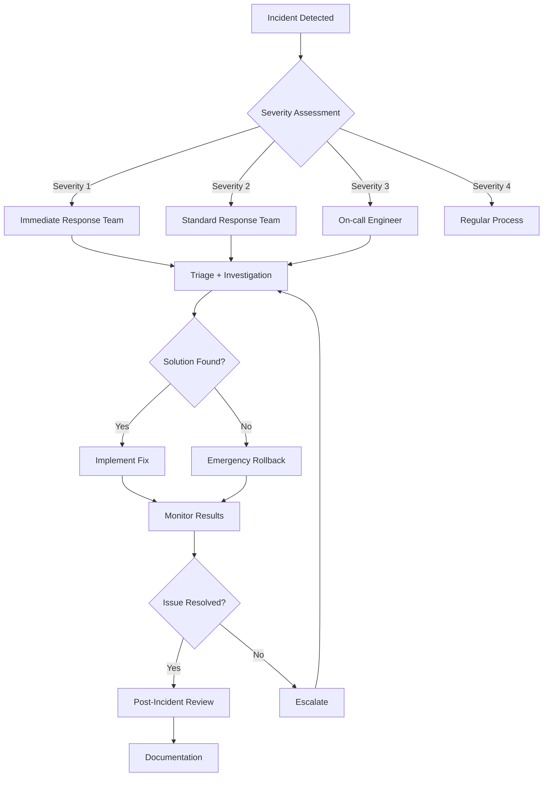

# Emergency Response Procedures

This section contains emergency response procedures for critical incidents affecting the Parsify platform.

## Table of Contents

- [Incident Response](./incident-response.md)
- [Rollback Procedures](./rollback.md)
- [Disaster Recovery](./disaster-recovery.md)
- [Security Incident Response](./security-incidents.md)
- [Data Recovery Procedures](./data-recovery.md)

## Severity Levels

### Critical (Severity 1)
- Service completely unavailable
- Data loss or corruption
- Security breach
- > 50% of users affected

### High (Severity 2)
- Major functionality broken
- Significant performance degradation
- > 25% of users affected

### Medium (Severity 3)
- Minor functionality issues
- Moderate performance impact
- > 10% of users affected

### Low (Severity 4)
- Cosmetic issues
- Minor performance impact
- < 10% of users affected

## Emergency Contacts

### Primary Contacts

- **On-call Engineer**: [Phone Number] - Available 24/7
- **Engineering Lead**: [Phone Number] - Secondary contact
- **DevOps Team**: [Slack Channel] - #emergency-response
- **Product Manager**: [Phone Number] - Business impact assessment

### Escalation Contacts

- **CTO**: [Phone Number] - Severity 1 incidents
- **CEO**: [Phone Number] - Business-critical incidents
- **Legal Team**: [Email] - Data breach incidents
- **PR Team**: [Email] - Public incidents

## Quick Response Actions

### Immediate Steps (First 5 Minutes)

1. **Assess the Situation**
   ```bash
   # Check service status
   curl -f https://api.parsify.dev/health
   curl -f https://parsify.dev/api/health
   
   # Check system metrics
   curl https://api.parsify.dev/metrics
   ```

2. **Gather Initial Information**
   - What is the nature of the issue?
   - When did it start?
   - How many users are affected?
   - What is the business impact?

3. **Initiate Communication**
   - Post in #emergency-response Slack channel
   - Call on-call engineer
   - Notify stakeholders if severity 1 or 2

### Triage Process (First 15 Minutes)

1. **Assign Severity Level**
2. **Form Incident Response Team**
3. **Create Incident Channel**
4. **Begin Investigation**
5. **Implement Temporary Fixes**

## Emergency Commands

### Service Status
```bash
# Health checks
curl https://api.parsify.dev/health
curl https://api.parsify.dev/health/detailed

# Service status
wrangler deployments list --env production
vercel ls --scope parsify-dev

# Error rate monitoring
wrangler tail --env production | grep ERROR
```

### Emergency Rollback
```bash
# API rollback
cd apps/api
wrangler rollback --env production

# Frontend rollback
cd apps/web
vercel rollback --scope parsify-dev --prod

# Database rollback (if needed)
wrangler d1 execute parsify-prod --file=backup-YYYYMMDD-HHMMSS.sql --env production
```

### Service Restart
```bash
# Restart API
cd apps/api
wrangler deploy --env production

# Restart frontend
cd apps/web
vercel --prod

# Clear cache
wrangler cache purge --env production
```

## Incident Response Flow



## Communication Templates

### Initial Incident Notification

**Title**: [SEVERITY] Service Incident - [Brief Description]

**Message**:
```
We are investigating a [severity] incident affecting [service/component].

- Status: Investigating
- Started: [Time]
- Impact: [Description of impact]
- Next Update: [Time + 30 minutes]

Follow updates in: #incident-[number]
```

### Resolution Notification

**Title**: RESOLVED: Service Incident - [Brief Description]

**Message**:
```
The incident affecting [service/component] has been resolved.

- Status: Resolved
- Duration: [Duration]
- Impact: [Final impact assessment]
- Root Cause: [Brief description]
- Preventive Measures: [Actions taken]

We apologize for any inconvenience caused.
```

## Escalation Criteria

### Immediate Escalation

- **Data Loss**: Any confirmed data loss
- **Security Breach**: Confirmed or suspected security incident
- **Extended Downtime**: Service unavailable > 30 minutes
- **Financial Impact**: Revenue impact > $10,000/hour

### Escalation Process

1. **Level 1**: On-call Engineer (15 minutes)
2. **Level 2**: Engineering Lead (30 minutes)
3. **Level 3**: DevOps Team (1 hour)
4. **Level 4**: CTO/CEO (2 hours)

## Post-Incident Procedures

### Immediate Actions (First Hour)

1. **Verify Resolution**: Confirm fix is working
2. **Extended Monitoring**: Watch for recurrence
3. **User Communication**: Notify all stakeholders
4. **Initial Documentation**: Record timeline and actions

### Post-Incident Review (Within 24 Hours)

1. **Timeline Analysis**: Document detailed incident timeline
2. **Root Cause Analysis**: Identify underlying causes
3. **Impact Assessment**: Measure business and user impact
4. **Action Items**: Create preventive measures
5. **Process Review**: Evaluate response effectiveness

### Long-term Actions (Within 1 Week)

1. **Implement Fixes**: Address root causes
2. **Update Documentation**: Revise runbooks and procedures
3. **Improve Monitoring**: Add alerts and metrics
4. **Team Training**: Conduct incident response training
5. **Process Improvements**: Refine response procedures

## Monitoring During Incidents

### Key Metrics to Monitor

- **Availability**: Service uptime percentage
- **Error Rate**: Percentage of failed requests
- **Response Time**: Average and p95 response times
- **Throughput**: Requests per second
- **User Impact**: Number of affected users

### Alert Thresholds

- **Error Rate**: > 5% (Critical), > 2% (Warning)
- **Response Time**: > 2s (Critical), > 1s (Warning)
- **Availability**: < 99% (Critical), < 99.5% (Warning)

## Tools and Resources

### Monitoring Tools

- **Application Monitoring**: [Monitoring Dashboard URL]
- **Error Tracking**: [Sentry Dashboard URL]
- **Performance Monitoring**: [APM Dashboard URL]
- **Infrastructure Monitoring**: [Infrastructure Dashboard URL]

### Communication Tools

- **Slack**: #emergency-response, #alerts
- **Email**: engineering@parsify.dev
- **Phone**: Emergency contact list
- **Status Page**: [Status Page URL]

## Training and Preparation

### Incident Response Training

- Monthly tabletop exercises
- Quarterly live simulations
- Annual full incident drill
- New hire onboarding sessions

### Documentation Requirements

- Keep runbooks updated
- Maintain contact lists
- Document all incidents
- Regular review procedures

## Related Documents

- [Rollback Procedures](./rollback.md)
- [Disaster Recovery](./disaster-recovery.md)
- [Security Incidents](./security-incidents.md)
- [Data Recovery](./data-recovery.md)
- [Change Management](../operations/change-management.md)