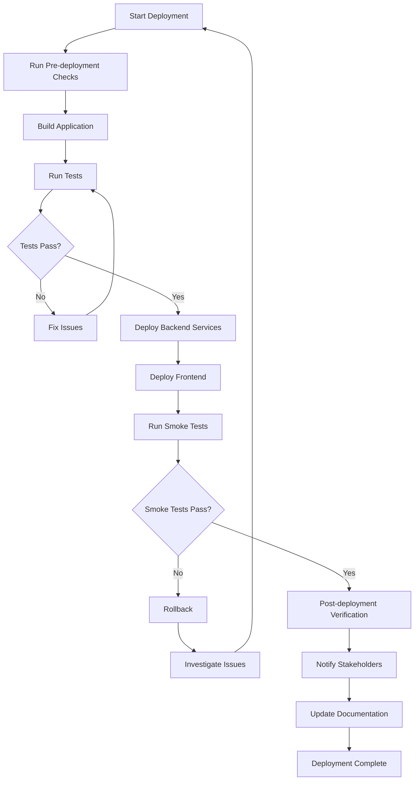

# Deployment Procedures

This section contains detailed procedures for deploying the Parsify platform to different environments.

## Overview

The Parsify platform uses a multi-environment deployment strategy:

- **Development**: Local development environment
- **Staging**: Testing environment with production-like configuration
- **Production**: Live production environment

## Architecture

### Components

- **Web Application** (Next.js): Frontend application hosted on Vercel
- **API Service** (Cloudflare Workers): Backend API services
- **Database** (Cloudflare D1): SQLite-based database
- **Storage** (Cloudflare R2): Object storage for files
- **Cache** (Cloudflare KV): Key-value storage for caching
- **CDN** (Cloudflare): Content delivery network

### Deployment Tools

- **Wrangler**: Cloudflare Workers CLI
- **Vercel CLI**: Frontend deployment
- **PNPM**: Package management
- **GitHub Actions**: CI/CD pipeline

## Prerequisites

Before any deployment, ensure:

1. **Access Permissions**: Proper access to all services and tools
2. **Environment Setup**: All environment variables configured
3. **Dependencies**: All dependencies installed and up to date
4. **Tests**: All tests passing in the target branch
5. **Backup**: Current system state backed up
6. **Communication**: Stakeholders notified of deployment window

## Environment-Specific Procedures

Choose the appropriate deployment procedure:

- [Staging Deployment](./staging-deployment.md) - For testing and validation
- [Production Deployment](./production-deployment.md) - For live deployment
- [Environment Setup](./environment-setup.md) - For new environment configuration

## Deployment Flow

## Safety Checklist

Before any deployment:

- [ ] Backup current production state
- [ ] Verify all tests are passing
- [ ] Check environment variable configuration
- [ ] Validate database connectivity
- [ ] Confirm rollback plan is ready
- [ ] Notify all stakeholders
- [ ] Schedule appropriate deployment window
- [ ] Prepare monitoring and alerting

## Post-Deployment

After successful deployment:

- [ ] Run smoke tests
- [ ] Verify application functionality
- [ ] Check monitoring dashboards
- [ ] Monitor error rates
- [ ] Document deployment details
- [ ] Update version numbers
- [ ] Communicate success to stakeholders

## Rollback Criteria

Initiate rollback if:

- Critical errors are detected
- Performance degrades significantly
- User-facing functionality is broken
- Security vulnerabilities are identified
- Data corruption occurs
- Service availability drops below SLA

## Related Documentation

- [Emergency Response](../emergency/incident-response.md)
- [Rollback Procedures](../emergency/rollback.md)
- [Troubleshooting Guide](../troubleshooting/common-issues.md)
- [Monitoring Procedures](../monitoring/health-checks.md)