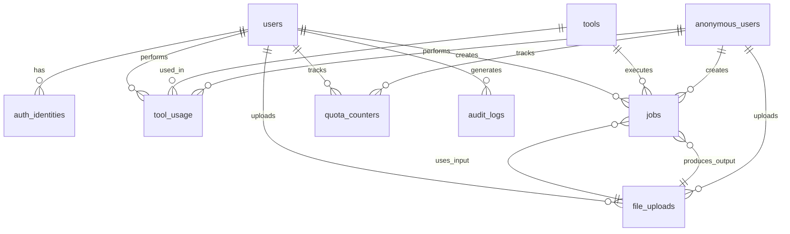

# Data Model: Online Developer Tools Platform

**Version**: 1.0
**Date**: 2025-10-08
**Database**: Cloudflare D1 (SQLite)

## Core Entities

### User Management

#### users
Represents registered users in the system.

```sql
CREATE TABLE users (
  id TEXT PRIMARY KEY,                    -- UUID v4
  email TEXT UNIQUE NOT NULL,             -- User email
  name TEXT,                              -- Display name
  avatar_url TEXT,                        -- Profile picture URL
  subscription_tier TEXT DEFAULT 'free', -- free, pro, enterprise
  preferences JSON,                       -- User preferences (theme, default tools)
  created_at INTEGER NOT NULL,            -- Unix timestamp
  updated_at INTEGER NOT NULL,            -- Unix timestamp
  last_login_at INTEGER                   -- Unix timestamp
);

-- Indexes
CREATE INDEX idx_users_email ON users(email);
CREATE INDEX idx_users_subscription ON users(subscription_tier);
CREATE INDEX idx_users_last_login ON users(last_login_at);
```

**Key Attributes**:
- `id`: Primary identifier for user
- `subscription_tier`: Determines feature access and limits
- `preferences`: JSON object with user settings
- `last_login_at`: For analytics and security monitoring

#### auth_identities
Links external authentication providers to user accounts.

```sql
CREATE TABLE auth_identities (
  id TEXT PRIMARY KEY,                    -- UUID v4
  user_id TEXT NOT NULL,                  -- Foreign key to users.id
  provider TEXT NOT NULL,                 -- google, github, oauth2
  provider_uid TEXT NOT NULL,             -- Provider's user ID
  provider_data JSON,                     -- Provider-specific data
  created_at INTEGER NOT NULL,            -- Unix timestamp

  FOREIGN KEY (user_id) REFERENCES users(id) ON DELETE CASCADE,
  UNIQUE(provider, provider_uid)
);

-- Indexes
CREATE INDEX idx_auth_identities_user_id ON auth_identities(user_id);
CREATE INDEX idx_auth_identities_provider ON auth_identities(provider);
```

**Relationships**: Many-to-one with users (user can have multiple auth providers)

### Tool System

#### tools
Catalog of available tools in the platform.

```sql
CREATE TABLE tools (
  id TEXT PRIMARY KEY,                    -- UUID v4
  slug TEXT UNIQUE NOT NULL,              -- URL-friendly identifier (json-format)
  name TEXT NOT NULL,                     -- Display name
  category TEXT NOT NULL,                 -- json, formatting, execution, text, image
  description TEXT,                       -- Tool description
  config JSON NOT NULL,                   -- Tool configuration schema
  enabled BOOLEAN DEFAULT true,           -- Active/inactive status
  beta BOOLEAN DEFAULT false,             -- Beta feature flag
  sort_order INTEGER DEFAULT 0,           -- Display order
  created_at INTEGER NOT NULL,            -- Unix timestamp
  updated_at INTEGER NOT NULL             -- Unix timestamp
);

-- Indexes
CREATE INDEX idx_tools_category ON tools(category);
CREATE INDEX idx_tools_enabled ON tools(enabled);
CREATE INDEX idx_tools_sort ON tools(sort_order);
```

**Key Attributes**:
- `slug`: SEO-friendly URL identifier
- `category`: Tool grouping (json, formatting, execution, text, image, network, crypto)
- `config`: JSON schema defining tool inputs/outputs and behavior

#### tool_usage
Tracks tool usage for analytics and billing.

```sql
CREATE TABLE tool_usage (
  id TEXT PRIMARY KEY,                    -- UUID v4
  user_id TEXT,                           -- Foreign key (NULL for anonymous)
  tool_id TEXT NOT NULL,                  -- Foreign key to tools.id
  input_size INTEGER DEFAULT 0,           -- Input data size in bytes
  output_size INTEGER DEFAULT 0,          -- Output data size in bytes
  execution_time_ms INTEGER,              -- Execution time in milliseconds
  status TEXT NOT NULL,                   -- success, error, timeout
  error_message TEXT,                     -- Error details if failed
  ip_address TEXT,                        -- User IP for analytics
  user_agent TEXT,                        -- Browser/client info
  created_at INTEGER NOT NULL,            -- Unix timestamp

  FOREIGN KEY (user_id) REFERENCES users(id) ON DELETE SET NULL,
  FOREIGN KEY (tool_id) REFERENCES tools(id)
);

-- Indexes
CREATE INDEX idx_tool_usage_user_id ON tool_usage(user_id);
CREATE INDEX idx_tool_usage_tool_id ON tool_usage(tool_id);
CREATE INDEX idx_tool_usage_created_at ON tool_usage(created_at);
CREATE INDEX idx_tool_usage_status ON tool_usage(status);
```

### Job Processing

#### jobs
Asynchronous job processing for long-running operations.

```sql
CREATE TABLE jobs (
  id TEXT PRIMARY KEY,                    -- UUID v4
  user_id TEXT,                           -- Foreign key (NULL for anonymous)
  tool_id TEXT NOT NULL,                  -- Foreign key to tools.id
  status TEXT NOT NULL DEFAULT 'pending', -- pending, running, completed, failed
  input_data JSON,                        -- Job input parameters
  output_data JSON,                       -- Job results
  input_ref TEXT,                         -- R2 reference for input files
  output_ref TEXT,                        -- R2 reference for output files
  progress INTEGER DEFAULT 0,             -- Progress percentage (0-100)
  error_message TEXT,                     -- Error details if failed
  retry_count INTEGER DEFAULT 0,          -- Number of retry attempts
  started_at INTEGER,                     -- Unix timestamp when started
  completed_at INTEGER,                   -- Unix timestamp when completed
  created_at INTEGER NOT NULL,            -- Unix timestamp
  updated_at INTEGER NOT NULL,            -- Unix timestamp

  FOREIGN KEY (user_id) REFERENCES users(id) ON DELETE SET NULL,
  FOREIGN KEY (tool_id) REFERENCES tools(id)
);

-- Indexes
CREATE INDEX idx_jobs_user_id ON jobs(user_id);
CREATE INDEX idx_jobs_status ON jobs(status);
CREATE INDEX idx_jobs_created_at ON jobs(created_at);
CREATE INDEX idx_jobs_tool_id ON jobs(tool_id);
```

**State Transitions**:
- `pending` → `running` → `completed`/`failed`
- Retry mechanism for failed jobs
- Progress tracking for long-running operations

### File Management

#### file_uploads
Tracks user-uploaded files for processing.

```sql
CREATE TABLE file_uploads (
  id TEXT PRIMARY KEY,                    -- UUID v4
  user_id TEXT,                           -- Foreign key (NULL for anonymous)
  filename TEXT NOT NULL,                 -- Original filename
  mime_type TEXT NOT NULL,                -- File MIME type
  size_bytes INTEGER NOT NULL,            -- File size in bytes
  r2_key TEXT NOT NULL,                   -- R2 storage key
  checksum TEXT,                          -- SHA-256 checksum
  status TEXT NOT NULL DEFAULT 'uploading', -- uploading, completed, expired
  expires_at INTEGER,                     -- Unix timestamp for auto-cleanup
  created_at INTEGER NOT NULL,            -- Unix timestamp

  FOREIGN KEY (user_id) REFERENCES users(id) ON DELETE SET NULL
);

-- Indexes
CREATE INDEX idx_file_uploads_user_id ON file_uploads(user_id);
CREATE INDEX idx_file_uploads_status ON file_uploads(status);
CREATE INDEX idx_file_uploads_expires_at ON file_uploads(expires_at);
```

**Lifecycle**: Files automatically expire after 72 hours for free users, 7 days for premium users.

### Rate Limiting

#### quota_counters
Per-user quota tracking for rate limiting.

```sql
CREATE TABLE quota_counters (
  id TEXT PRIMARY KEY,                    -- UUID v4
  user_id TEXT,                           -- Foreign key (NULL for IP-based limits)
  quota_type TEXT NOT NULL,               -- api_requests, file_uploads, execution_time
  period_start INTEGER NOT NULL,          -- Unix timestamp for period start
  period_end INTEGER NOT NULL,            -- Unix timestamp for period end
  used_count INTEGER DEFAULT 0,           -- Current usage count
  limit_count INTEGER NOT NULL,           -- Maximum allowed
  ip_address TEXT,                        -- IP address for anonymous users
  created_at INTEGER NOT NULL,            -- Unix timestamp
  updated_at INTEGER NOT NULL,            -- Unix timestamp

  FOREIGN KEY (user_id) REFERENCES users(id) ON DELETE CASCADE,
  UNIQUE(user_id, quota_type, period_start, ip_address)
);

-- Indexes
CREATE INDEX idx_quota_counters_user_id ON quota_counters(user_id);
CREATE INDEX idx_quota_counters_period ON quota_counters(period_start, period_end);
CREATE INDEX idx_quota_counters_type ON quota_counters(quota_type);
```

**Quota Types**:
- `api_requests`: API call limits per hour/day
- `file_uploads`: File upload limits per hour/day
- `execution_time`: Code execution time limits per hour/day
- `bandwidth`: Download bandwidth limits per day

### Audit Logging

#### audit_logs
Security and compliance logging.

```sql
CREATE TABLE audit_logs (
  id TEXT PRIMARY KEY,                    -- UUID v4
  user_id TEXT,                           -- Foreign key (NULL for anonymous)
  action TEXT NOT NULL,                   -- login, tool_execute, file_upload
  resource_type TEXT,                     -- user, job, file_upload, tool_usage
  resource_id TEXT,                       -- ID of affected resource
  old_values JSON,                        -- Previous state for updates
  new_values JSON,                        -- New state for updates
  ip_address TEXT,                        -- User IP address
  user_agent TEXT,                        -- Browser/client info
  success BOOLEAN DEFAULT true,           -- Action success status
  error_message TEXT,                     -- Error details if failed
  created_at INTEGER NOT NULL,            -- Unix timestamp

  FOREIGN KEY (user_id) REFERENCES users(id) ON DELETE SET NULL
);

-- Indexes
CREATE INDEX idx_audit_logs_user_id ON audit_logs(user_id);
CREATE INDEX idx_audit_logs_action ON audit_logs(action);
CREATE INDEX idx_audit_logs_created_at ON audit_logs(created_at);
CREATE INDEX idx_audit_logs_resource ON audit_logs(resource_type, resource_id);
```

## Data Relationships



## JSON Schemas

### Tool Configuration Schema
```json
{
  "$schema": "http://json-schema.org/draft-07/schema#",
  "type": "object",
  "properties": {
    "inputSchema": {
      "type": "object",
      "description": "JSON schema for tool input validation"
    },
    "outputSchema": {
      "type": "object",
      "description": "JSON schema for tool output validation"
    },
    "executionMode": {
      "type": "string",
      "enum": ["sync", "async", "streaming"],
      "description": "How the tool executes"
    },
    "quotas": {
      "type": "object",
      "properties": {
        "maxInputSize": {"type": "integer"},
        "maxExecutionTime": {"type": "integer"},
        "requiresAuth": {"type": "boolean"}
      }
    }
  },
  "required": ["inputSchema", "outputSchema", "executionMode"]
}
```

### User Preferences Schema
```json
{
  "$schema": "http://json-schema.org/draft-07/schema#",
  "type": "object",
  "properties": {
    "theme": {
      "type": "string",
      "enum": ["light", "dark", "system"],
      "default": "system"
    },
    "defaultLanguage": {
      "type": "string",
      "description": "Preferred code execution language"
    },
    "autoSave": {
      "type": "boolean",
      "default": true
    },
    "showAdvancedOptions": {
      "type": "boolean",
      "default": false
    }
  }
}
```

## Migration Strategy

### Version 1.0 (MVP)
- Core tables: users, auth_identities, tools, tool_usage, jobs
- Basic functionality for JSON tools and code execution

### Version 1.1 (Post-MVP)
- Add file_uploads table for file processing
- Add quota_counters for rate limiting
- Add audit_logs for security logging

### Version 2.0 (Premium Features)
- Add subscription management tables
- Add billing and invoice tables
- Add advanced analytics tables

## Performance Considerations

### Indexing Strategy
- Primary indexes on all foreign keys
- Composite indexes for common query patterns
- Time-based indexes for analytics queries
- Partial indexes for filtering active records

### Data Retention
- Tool usage logs: 90 days
- Audit logs: 1 year
- Job records: 30 days (completed), 7 days (failed)
- File uploads: 72 hours auto-cleanup

### Partitioning (Future)
- Partition tool_usage by month for large datasets
- Partition audit_logs by quarter for compliance
- Consider archive tables for historical data